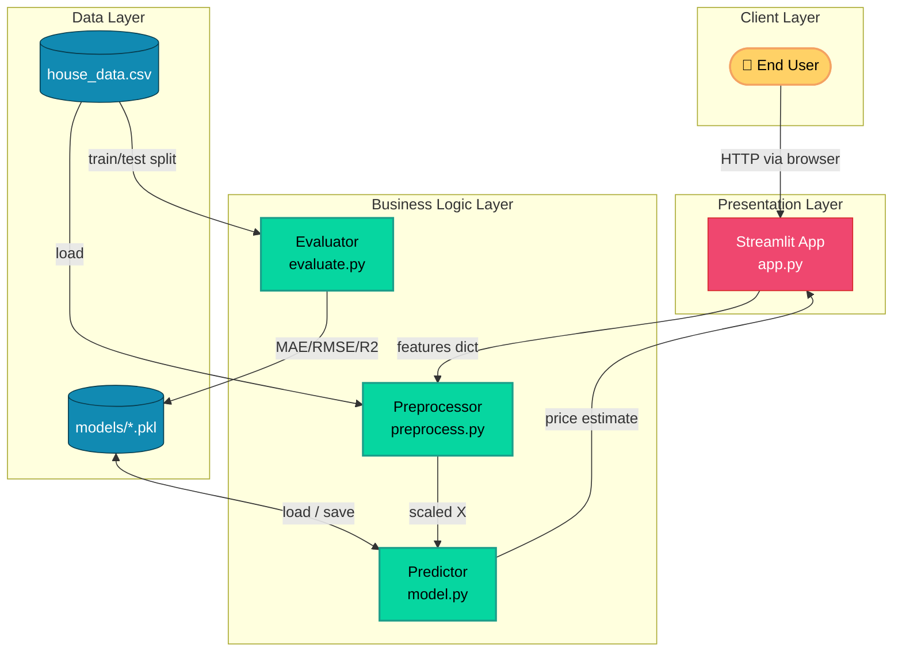
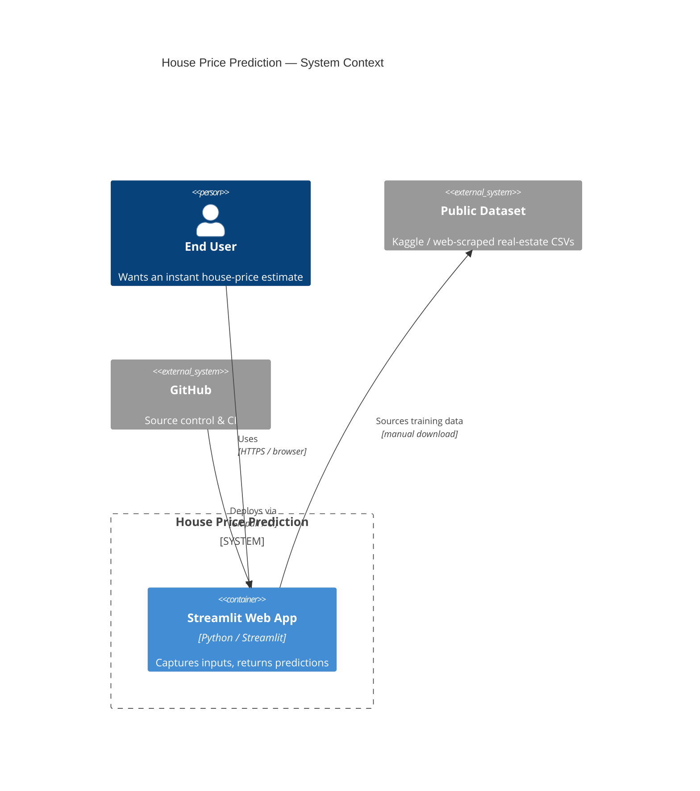
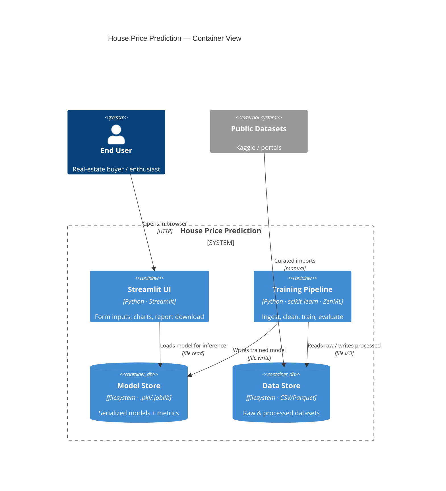
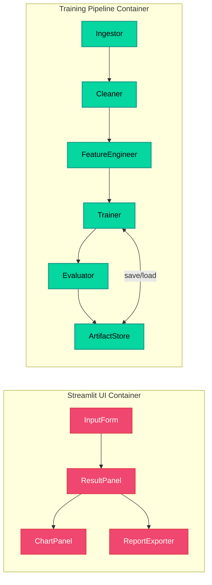
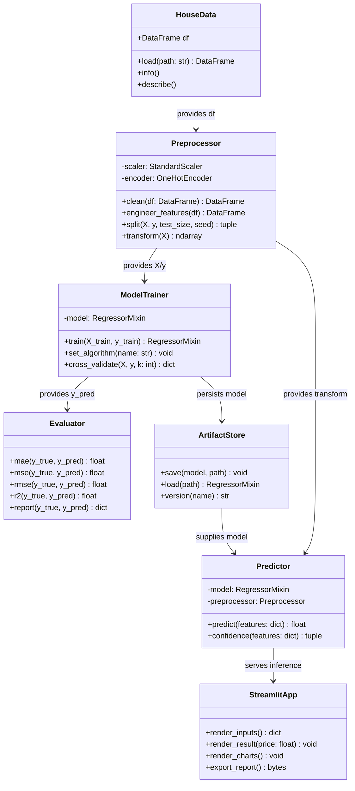
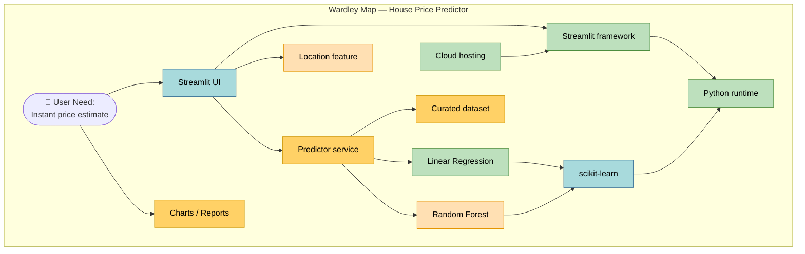
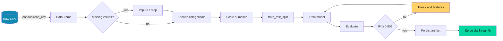

# 🏛️ ARCHITECTURE.md — House Price Prediction App

> Technical architecture reference: system design, C4 model, class structure, Wardley Map, and design decisions.

---

## 📑 Table of Contents

1. [Design Principles](#-design-principles)
2. [High-Level Architecture](#-high-level-architecture)
3. [C4 Model](#-c4-model)
   - [Level 1 — System Context](#level-1--system-context)
   - [Level 2 — Container](#level-2--container)
   - [Level 3 — Component](#level-3--component)
4. [Class Diagram](#-class-diagram)
5. [Wardley Map](#-wardley-map)
6. [Data Flow](#-data-flow)
7. [Components & Responsibilities](#-components--responsibilities)
8. [Design Decisions (ADR-style)]#️-design-decisions-adr-style)
9. [Non-Functional Requirements](#-non-functional-requirements)
10. [Risk Register](#-risk-register)

---

## 🎯 Design Principles

| Principle | How it's applied |
|-----------|------------------|
| **Separation of concerns** | Data, modeling, and UI live in distinct modules; `app.py` never imports sklearn internals directly, only `model.predict`. |
| **Reproducibility** | All randomness is seeded (`random_state=42`); model artifacts are versioned by training date. |
| **Idempotent pipeline** | Re-running `train.py` from raw CSV yields the same model artifact. |
| **Thin UI, fat model** | Streamlit is a presentation layer; all business logic is in `preprocess.py` / `model.py`. |
| **Fail loud, fail early** | Invalid inputs raise typed exceptions surfaced as user-friendly Streamlit errors. |

---

## 🏗️ High-Level Architecture



---

## 🧱 C4 Model

### Level 1 — System Context



### Level 2 — Container



### Level 3 — Component



---

## 🧬 Class Diagram



---

## 🗺️ Wardley Map

Maps each component on **Evolution (Genesis → Custom → Product → Commodity)** × **Value Chain (visible to user → hidden infrastructure)**.



**Interpretation**

- *Genesis/Custom* (Location, Random Forest, Predictor): high differentiation — invest here for competitive edge.
- *Product* (scikit-learn, Streamlit UI): standardized building blocks — adopt, don't reinvent.
- *Commodity* (Python, cloud hosting, linear regression): use as utilities; minimize effort.

---

## 🔄 Data Flow



---

## 🧩 Components & Responsibilities

| Component        | File             | Responsibility |
|------------------|------------------|----------------|
| HouseData        | `preprocess.py`  | Load & sanity-check dataset |
| Preprocessor     | `preprocess.py`  | Clean, encode, scale, split |
| ModelTrainer     | `train.py`       | Fit regressor, cross-validate |
| Evaluator        | `evaluate.py`    | Compute MAE/MSE/RMSE/R² |
| ArtifactStore    | `model.py`       | Persist & version models |
| Predictor        | `model.py`       | Wrap model + preprocess for inference |
| StreamlitApp     | `app.py`         | Render inputs, results, charts, reports |

---

## #️⃣ Design Decisions (ADR-style)

### ADR-001 — Linear Regression as baseline
**Status:** Accepted · **Context:** Beginner-friendly model with interpretable coefficients. **Decision:** Ship Linear Regression first; add Random Forest behind a toggle. **Consequences:** Easier debugging, fast training, transparent feature weights.

### ADR-002 — Streamlit over Flask/FastAPI
**Status:** Accepted · **Context:** Single-author project needing instant UI. **Decision:** Streamlit for both demo and production preview. **Consequences:** Rapid prototyping; limited control over routing — acceptable at current scale.

### ADR-003 — Filesystem artifact store
**Status:** Accepted · **Context:** Small team, low write frequency. **Decision:** Use `.joblib` files under `models/`. **Consequences:** No DB ops overhead; promote to MLflow/registry if scale grows.

### ADR-004 — Optional ZenML pipeline
**Status:** Proposed · **Context:** Reproducibility & audit needs grow. **Decision:** Wrap training steps in ZenML pipelines; keep `train.py` as a thin entrypoint. **Consequences:** Slight onboarding cost, much better traceability.

---

## 📈 Non-Functional Requirements

| Attribute     | Target |
|---------------|--------|
| Latency       | Single prediction < 200 ms (P95) |
| Throughput    | ≥ 10 concurrent users on 1 vCPU |
| Availability  | 99% (Streamlit Community Cloud) |
| Reproducibility | Deterministic with fixed seeds |
| Maintainability | ≥ 80% unit-test coverage on logic layer |
| Security      | No PII stored; input validation on all fields |

---

## ⚠️ Risk Register

| # | Risk | Likelihood | Impact | Mitigation |
|---|------|-----------|--------|------------|
| 1 | Dataset too small → overfit | High | High | Cross-validation, regularization, synthetic data |
| 2 | Location categories unseen at inference | Med | Med | `handle_unknown='ignore'` in encoder + fallback mean |
| 3 | Concept drift in market prices | Med | High | Periodic retraining schedule + monitoring |
| 4 | Streamlit scale ceiling | Low | Med | Migrate inference API to FastAPI if needed |
| 5 | Dependency breakage | Low | Med | Pin versions; run CI matrix on Python 3.10/3.11 |
```
