# 📘 GUIDE.md — The Complete Project Guide

> **House Price Prediction App** — A single, friendly document that explains *every file, every folder, how they connect, and how the model is trained.*
> Built for a **new user** who is making or modifying the model. No prior knowledge of this codebase assumed.

---

## 📑 Table of Contents

1. [Introduction — What Is This Project?](#-introduction--what-is-this-project)
2. [File Structure — Treeview](#-file-structure--treeview)
3. [What Every File & Folder Does](#-what-every-file--folder-does)
4. [How Files Connect to Each Other](#-how-files-connect-to-each-other)
5. [How the Model Is Trained (End-to-End)](#-how-the-model-is-trained-end-to-end)
6. [Architecture Diagrams](#-architecture-diagrams)
7. [C4 Diagrams (Context · Container · Component)](#-c4-diagrams)
8. [Sequence Diagrams](#-sequence-diagrams)
9. [Class Diagram](#-class-diagram)
10. [Block Diagram](#-block-diagram)
11. [Large Advanced Flowchart](#-large-advanced-flowchart)
12. [Entity Relationship Diagram](#-entity-relationship-diagram)
13. [User Journey Diagram](#-user-journey-diagram)
14. [Multi-Layer Event Modeling](#-multi-layer-event-modeling)
15. [Mindmaps](#-mindmaps)
16. [Kanban Diagram](#-kanban-diagram)
17. [Gantt Diagram](#-gantt-diagram)
18. [Git Graph](#-git-graph)
19. [XY Charts](#-xy-charts)
20. [Pie Charts](#-pie-charts)
21. [ML Theory & Design Decisions — Why This, Not That](#-ml-theory--design-decisions--why-this-not-that)
22. [Quick Start — 3 Commands](#-quick-start--3-commands)
23. [Common Modifications & Experiments](#-common-modifications--experiments)
24. [Troubleshooting Cheat-Sheet](#-troubleshooting-cheat-sheet)

---

## 🌟 Introduction — What Is This Project?

The **House Price Prediction App** predicts the price of a house (in **Lakhs ₹**) from 16 property features, using two Machine Learning models:

- **Linear Regression** — a fast, interpretable baseline (current R² = **0.9442**)
- **Random Forest** — 200 decision trees voting on the price (current R² = **0.9257**)

The whole system is a pipeline: **data → cleaning → encoding/scaling → training → evaluation → saved artifact → Streamlit web app**. A user opens a web page, enters house details, clicks *Predict*, and gets an instant price estimate with a 95% confidence band and a downloadable PDF report.

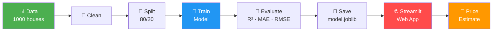

---

## 🌳 File Structure — Treeview

The exact layout of the repository (folders marked 📁, files marked 📄):

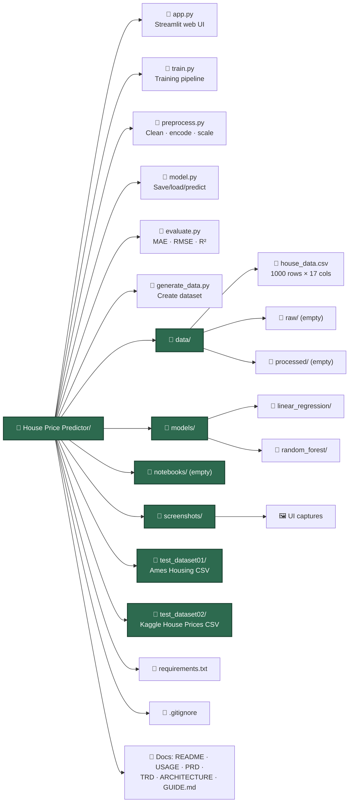

**Plain-text tree (copy-paste friendly):**

```text
House Price Predictor/
│
├── 📄 app.py                  # 🌐 Streamlit web UI (entry point for users)
├── 📄 train.py                # 🤖 Training pipeline orchestrator
├── 📄 preprocess.py           # 🧹 Data loading, cleaning, encoding, scaling
├── 📄 model.py                # 💾 Artifact save/load + Predictor wrapper
├── 📄 evaluate.py             # 📏 Regression metrics (MAE, RMSE, R²…)
├── 📄 generate_data.py        # 🎲 One-time synthetic dataset generator
├── 📄 requirements.txt        # 📦 Pinned Python dependencies
├── 📄 .gitignore              # 🚫 Files excluded from git
│
├── 📁 data/
│   ├── 📄 house_data.csv      # ← The 17-column dataset (1000 rows)
│   ├── 📁 raw/                # (reserved for original/raw data)
│   └── 📁 processed/          # (reserved for cleaned/saved data)
│
├── 📁 models/                 # ← Trained artifacts live here
│   ├── 📁 linear_regression/
│   │   └── 📁 <timestamp>/
│   │       ├── model.joblib   # ← Serialized model + preprocessor
│   │       └── metrics.json   # ← MAE/RMSE/R² scores
│   └── 📁 random_forest/
│       └── 📁 <timestamp>/
│           ├── model.joblib
│           └── metrics.json
│
├── 📁 notebooks/              # (reserved for EDA Jupyter notebooks)
│
├── 📁 screenshots/            # 🖼️ Browser captures of the running app
│
├── 📁 test_dataset01/         # 📊 Alternate dataset: Ames Housing
│   ├── 📄 AmesHousing.csv
│   └── 📄 test.py
│
├── 📁 test_dataset02/         # 📊 Alternate dataset: Kaggle House Prices
│   ├── 📄 train.csv
│   ├── 📄 data_description.txt
│   └── 📄 test.py
│
└── 📄 Docs
    ├── 📄 README.md           # Project overview & badges
    ├── 📄 USAGE.md            # Setup & contribution guide
    ├── 📄 PRD.md              # Product Requirements Document
    ├── 📄 TRD.md              # Technical Requirements Document
    ├── 📄 ARCHITECTURE.md     # System design reference
    ├── 📄 Idea.md             # Original project idea / plan
    ├── 📄 summary.md          # Private learning cheat-sheet (gitignored)
    └── 📄 GUIDE.md            # ← THIS FILE
```

---

## 📂 What Every File & Folder Does

### 🐍 Python Source Files

| # | File | Role | Key contents |
|---|------|------|--------------|
| 1 | **`generate_data.py`** | 🎲 **Dataset creator** | Builds 1000 realistic house rows with NumPy, computes Price from a formula, injects ~2% missing values so the cleaner has work to do. Writes `data/house_data.csv`. **Run once.** |
| 2 | **`preprocess.py`** | 🧹 **Data prep** | `HouseData` (loads CSV), `Preprocessor` (imputes NaN, one-hot encodes categoricals, scales numerics, 80/20 split). Defines which columns are numeric vs categorical. |
| 3 | **`evaluate.py`** | 📏 **Metrics** | `Evaluator` class: `mae`, `mse`, `rmse`, `r2`, `residual_std`, `report()`, `compare_models()`. |
| 4 | **`train.py`** | 🤖 **Orchestrator** | Wires everything together: load → clean → split → preprocess → train → cross-validate → evaluate → save. CLI: `python train.py --model all` |
| 5 | **`model.py`** | 💾 **Persistence + Inference** | `ArtifactStore` (save/load/version `.joblib` + `metrics.json`), `Predictor` (wraps model + preprocessor; `predict()` and `confidence()`). |
| 6 | **`app.py`** | 🌐 **Streamlit UI** | 3 tabs — **Predict**, **Compare**, **Charts** — plus sidebar inputs, PDF/text report download. The only file users interact with. |

### 📁 Folders

| Folder | Purpose |
|--------|---------|
| `data/` | Holds the dataset. `house_data.csv` is the live file; `raw/` & `processed/` are reserved. |
| `models/` | Each training run saves a timestamped subfolder (`model.joblib` + `metrics.json`). The app always loads the **latest** run. |
| `notebooks/` | Reserved for exploratory Jupyter notebooks (currently empty). |
| `screenshots/` | PNG captures of the running app for the README. |
| `test_dataset01/` | **Ames Housing** — an alternate real-world dataset (Iowa home sales) for experimentation. |
| `test_dataset02/` | **Kaggle House Prices** — the famous advanced-regression competition dataset. |

### 📄 The 16 Model Features (the CSV's 17 columns = 16 features + 1 target)

| # | Column | Type | Example | Role |
|---|--------|------|---------|------|
| 1 | `Area` | Numeric | 1800 | Built-up area (sq ft) |
| 2 | `Bedrooms` | Numeric | 3 | Bedroom count |
| 3 | `Bathrooms` | Numeric | 2 | Bathroom count |
| 4 | `Age` | Numeric | 5 | Property age (years) |
| 5 | `Location` | Categorical | Urban | Downtown / Urban / Suburban / Rural |
| 6 | **`Price`** | Numeric | 162.5 | 🎯 **TARGET (what we predict)** |
| 7 | `Lot Area` | Numeric | 9500 | Plot area (sq ft) |
| 8 | `Overall Quality` | Numeric | 5 | Material & finish (1–10) |
| 9 | `Overall Condition` | Numeric | 5 | Condition (1–10) |
| 10 | `Garage Cars` | Numeric | 1 | Garage capacity (cars) |
| 11 | `Garage Area` | Numeric | 480 | Garage size (sq ft) |
| 12 | `Total Basement SF` | Numeric | 800 | Basement area (sq ft) |
| 13 | `Fireplaces` | Numeric | 0 | Fireplace count |
| 14 | `Neighborhood` | Categorical | West Side | 28 named areas |
| 15 | `House Style` | Categorical | 1Story | 1Story / 2Story / SLvl / … |
| 16 | `Central Air` | Categorical | Yes | Yes / No |
| 17 | `Kitchen Quality` | Categorical | TA | Po / Fa / TA / Gd / Ex |

---

## 🔗 How Files Connect to Each Other

Think of the project as a **one-way assembly line** with a feedback loop at the end (the web app calls back into the saved model):

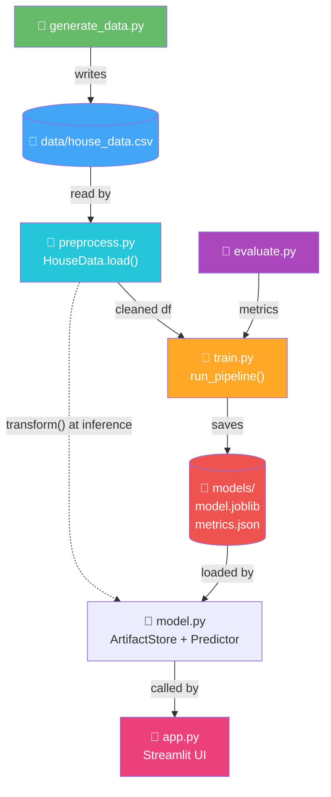

### The call graph in words

1. `generate_data.py` **writes** the CSV → consumed by `train.py` (via `preprocess.py`).
2. `train.py` **imports** `HouseData`, `Preprocessor` (from `preprocess.py`), `ModelTrainer` (itself), `Evaluator` (from `evaluate.py`), and `ArtifactStore` (from `model.py`).
3. `train.py` **saves** the model using `ArtifactStore.save()`.
4. `app.py` **imports** `ArtifactStore` + `Predictor` (from `model.py`) and **loads** the saved artifact.
5. At prediction time, `Predictor` re-uses the fitted `Preprocessor.transform()` that was **bundled** inside `model.joblib` — this guarantees the user's input is encoded the *exact same way* the training data was.

> ⚠️ **Critical insight:** The fitted `ColumnTransformer` is saved *inside* `model.joblib`. That's why the web app produces consistent predictions — it never re-fits; it only `transform()`s new input.

---

## 🏗️ How the Model Is Trained (End-to-End)

This is the heart of the project. Follow these 9 stages in order — they map 1:1 to the log output of `python train.py`.

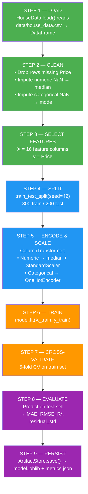

### Detailed stage explanations

| Stage | What happens | Where in code |
|-------|--------------|---------------|
| **1. Load** | `pd.read_csv()` → DataFrame (1000 × 17) | `HouseData.load()` in `preprocess.py` |
| **2. Clean** | Drop NaN-Price rows; impute numeric → median, categorical → mode | `Preprocessor.clean()` in `preprocess.py` |
| **3. Select** | Split DataFrame into `X` (16 cols) and `y` (Price) | `train.py` `run_pipeline()` |
| **4. Split** | `train_test_split(test_size=0.2, seed=42)` → 800 train / 200 test | `Preprocessor.split()` |
| **5. Encode/Scale** | `ColumnTransformer.fit_transform()` builds 55 encoded columns (11 scaled + 44 one-hot) | `Preprocessor.fit_transform()` |
| **6. Train** | `model.fit(X_train_enc, y_train)` — the model *learns* the price formula | `ModelTrainer.train()` in `train.py` |
| **7. Cross-validate** | 5-fold CV checks for overfitting | `ModelTrainer.cross_validate()` |
| **8. Evaluate** | Predict on the held-out test set → compute metrics | `Evaluator.report()` in `evaluate.py` |
| **9. Persist** | `joblib.dump({model, preprocessor})` + `metrics.json` to timestamped folder | `ArtifactStore.save()` in `model.py` |

---

## 🏛️ Architecture Diagrams

### High-level layered architecture

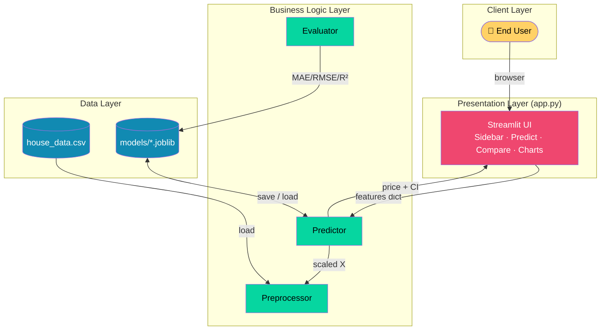

### Design principles applied

| Principle | How it's applied |
|-----------|------------------|
| **Separation of concerns** | Data (preprocess), modeling (train/model), UI (app) are isolated modules |
| **Reproducibility** | Every random source is seeded (`random_state=42`); artifacts versioned by timestamp |
| **Thin UI, fat model** | Streamlit only renders; all logic lives in Python classes |
| **Fail loud, fail early** | Invalid inputs raise typed exceptions surfaced as user errors |

---

## 🧱 C4 Diagrams

### Level 1 — System Context

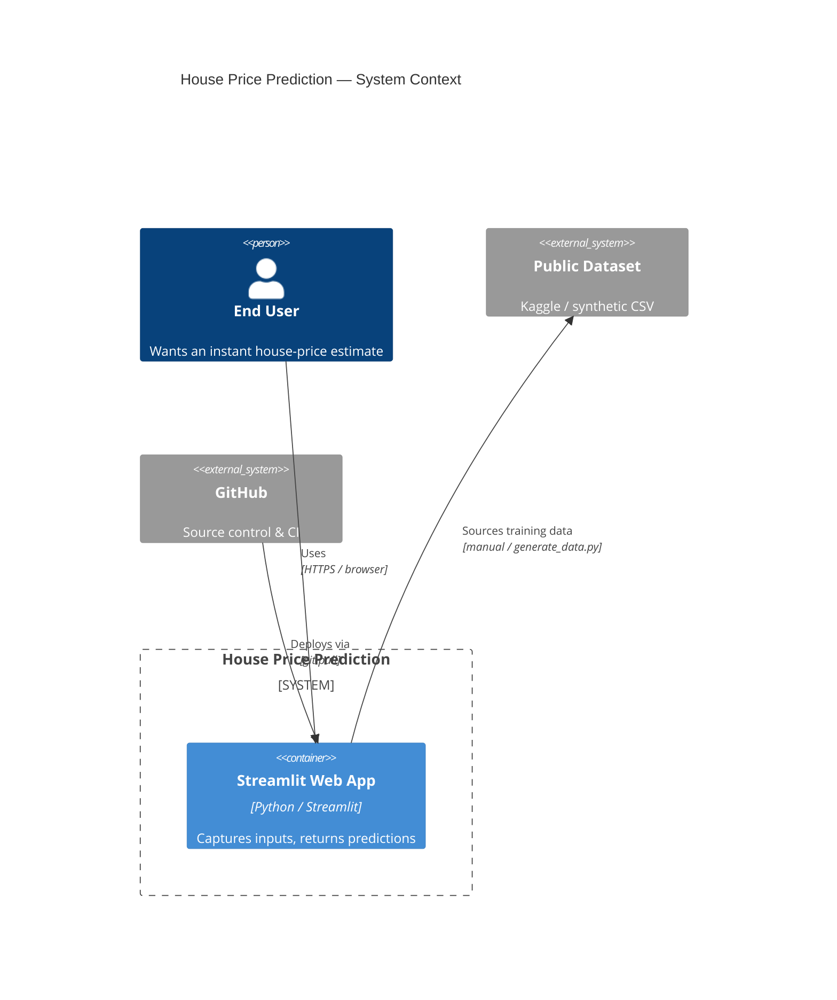

### Level 2 — Container

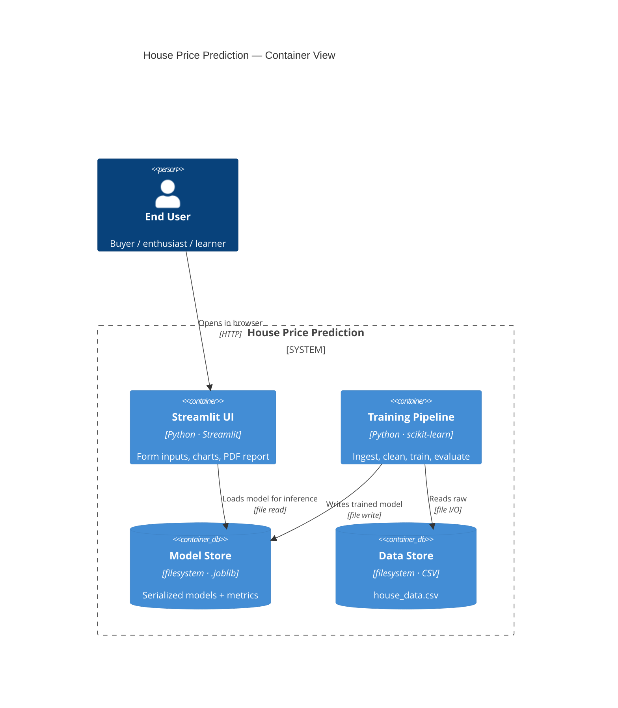

### Level 3 — Component

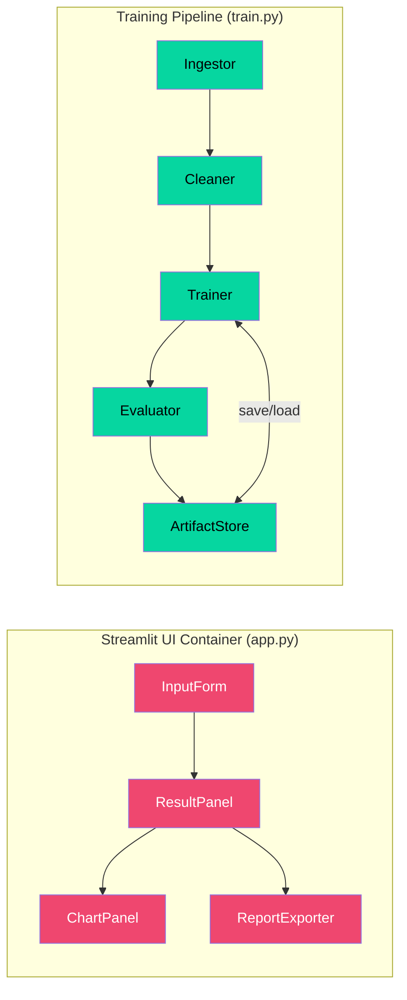

---

## 🔁 Sequence Diagrams

### Prediction flow (user → result)

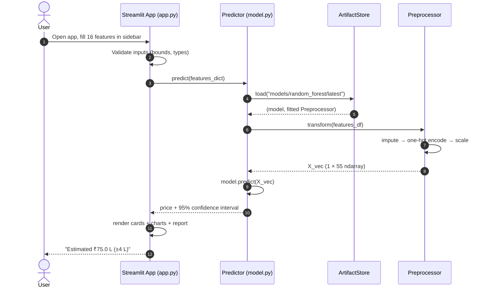

### Training flow (developer → saved artifact)

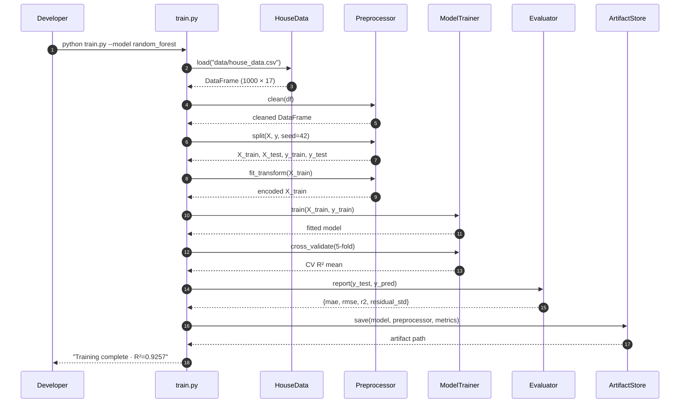

---

## 🧬 Class Diagram

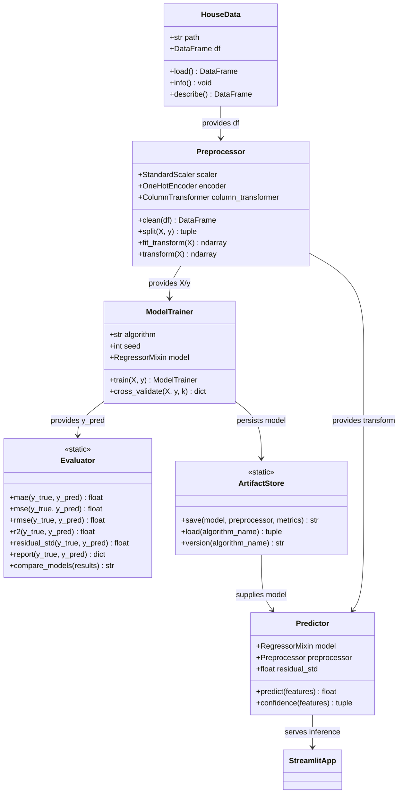

---

## 🧱 Block Diagram

A black-box view — each block is a module; arrows show data handoff.

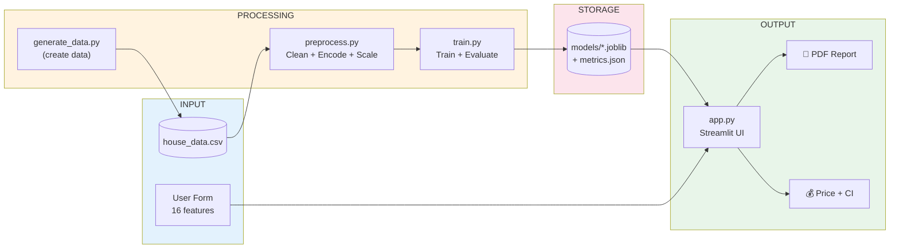

---

## 🗺️ Large Advanced Flowchart

The full decision tree covering **both** the training path and the inference path, including error branches.

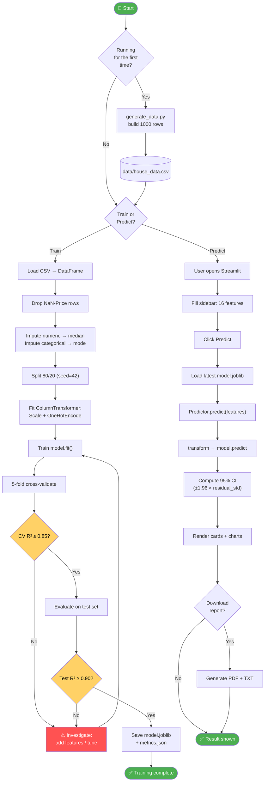

---

## 🗃️ Entity Relationship Diagram

The data model: how the **dataset**, **features**, **model**, and **metrics** entities relate.

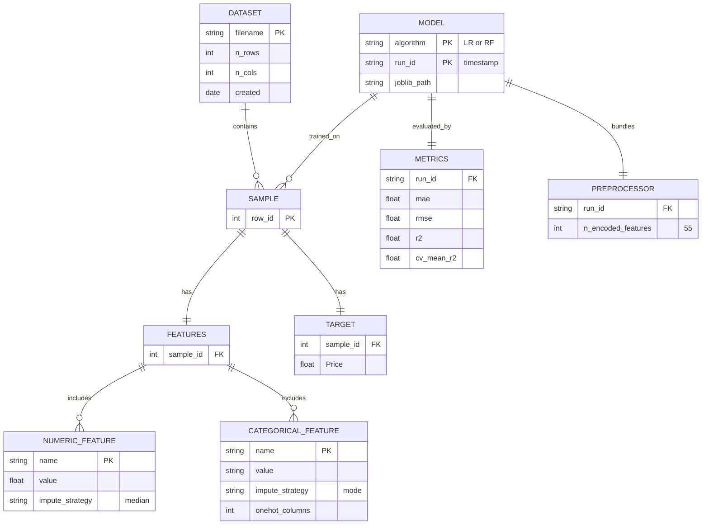

---

## 🛣️ User Journey Diagram

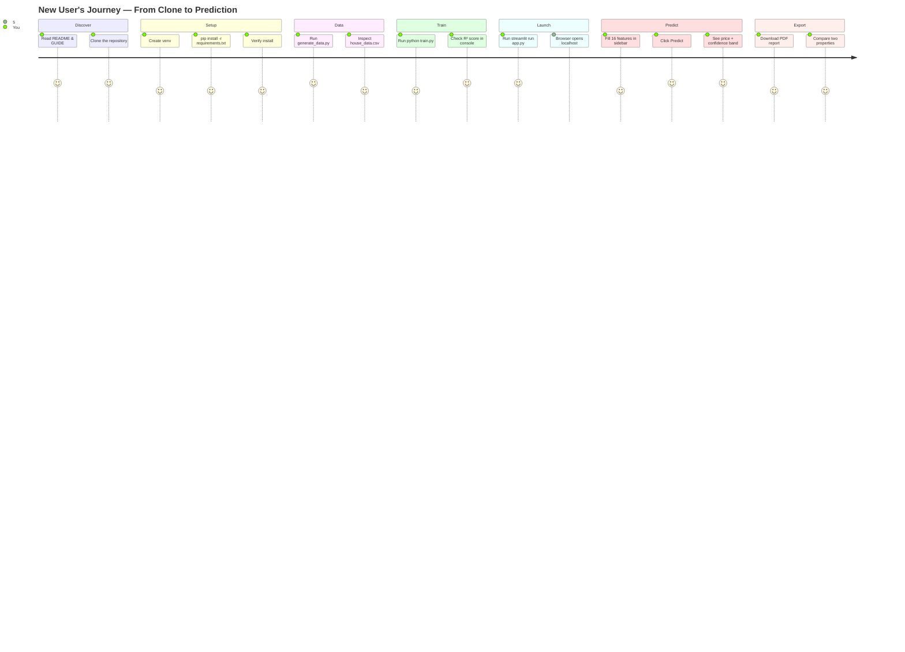

---

## 🎭 Multi-Layer Event Modeling

Shows events across **UI · Application · Model · Storage** layers simultaneously.

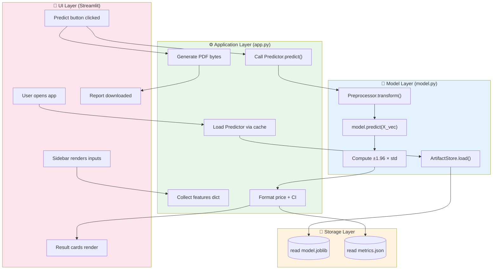

---

## 🧠 Mindmaps

### Project scope mindmap

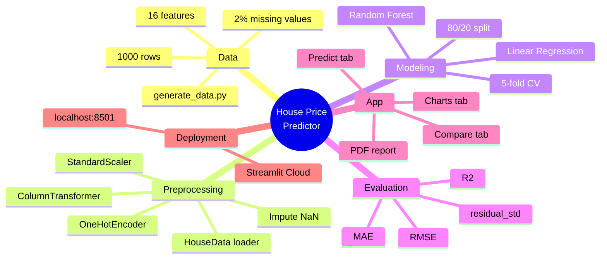

### Dataset feature mindmap

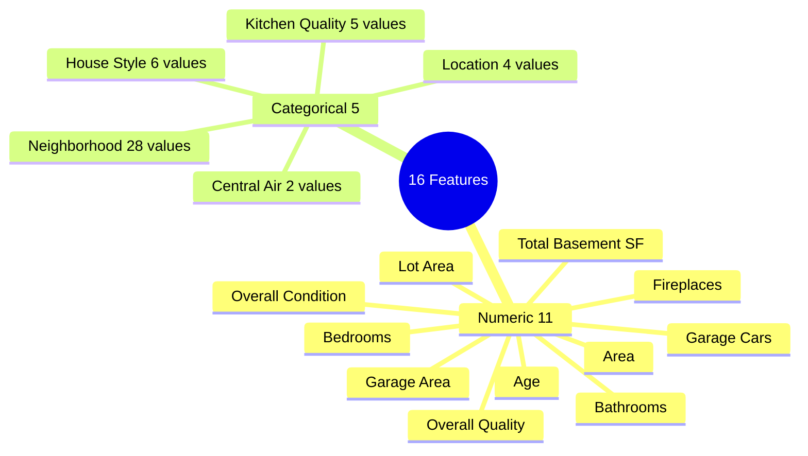

---

## 📋 Kanban Diagram

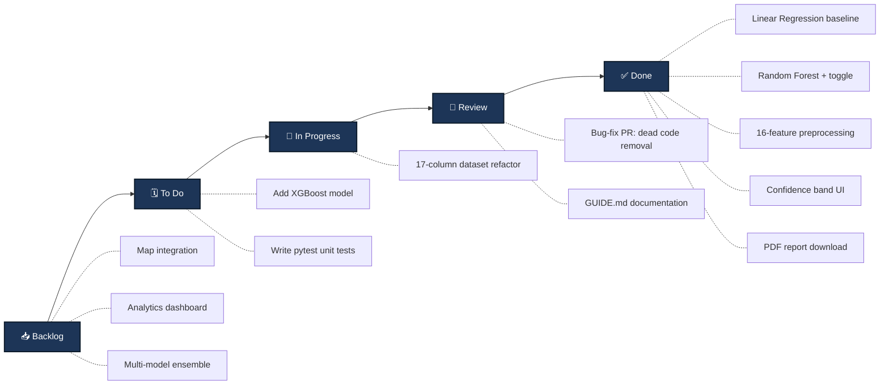

---

## 📅 Gantt Diagram

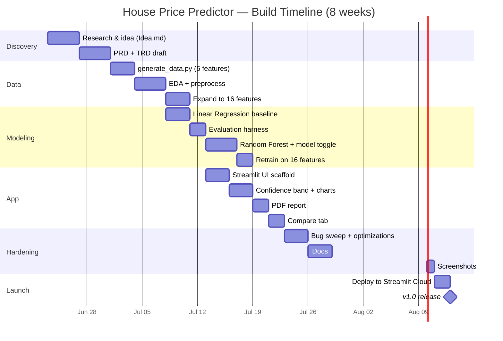

---

## 🌿 Git Graph

```mermaid
gitGraph
    commit id: "init"
    commit id: "scaffold"
    commit id: "5-feature model"
    branch develop
    checkout develop
    commit id: "preprocessing"
    commit id: "LR + RF"
    commit id: "Streamlit UI"
    commit id: "16-feature refactor"
    commit id: "bug-fix sweep"
    branch docs/guide
    commit id: "GUIDE.md"
    checkout develop
    merge docs/guide
    checkout main
    merge develop tag: "v1.0"
```

**Branching rules**
- `main` — always deployable; tagged releases only.
- `develop` — integration branch.
- `feat/*`, `fix/*`, `docs/*` — short-lived feature branches → PR into `develop`.
- Conventional commits: `feat:`, `fix:`, `docs:`, `test:`, `chore:`.

---

## 📈 XY Charts

### Model performance comparison (actual measured values)

```mermaid
xychart-beta
    title "R² Score — Higher is Better"
    x-axis ["Linear Regression", "Random Forest"]
    y-axis "R² Score" 0.85 --> 0.96
    bar [0.9442, 0.9257]
```

```mermaid
xychart-beta
    title "MAE (Lakhs ₹) — Lower is Better"
    x-axis ["Linear Regression", "Random Forest"]
    y-axis "MAE" 0 --> 20
    bar [14.42, 16.07]
```

```mermaid
xychart-beta
    title "RMSE (Lakhs ₹) — Lower is Better"
    x-axis ["Linear Regression", "Random Forest"]
    y-axis "RMSE" 0 --> 25
    bar [18.71, 21.59]
```

### R² vs. dataset size (illustrative scaling curve)

```mermaid
xychart-beta
    title "R² vs. Training Data Size"
    x-axis ["100", "500", "1k", "5k", "10k", "50k"]
    y-axis "R² Score" 0 --> 1
    line [0.65, 0.82, 0.94, 0.96, 0.97, 0.98]
```

### Inference latency vs. concurrency

```mermaid
xychart-beta
    title "Inference Latency vs. Concurrency"
    x-axis ["1", "5", "10", "25", "50", "100"]
    y-axis "Latency (ms)" 0 --> 1000
    line [45, 60, 110, 320, 720, 950]
```

---

## 🥧 Pie Charts

### Feature type distribution (16 features)

```mermaid
pie showData
    title Feature Types (16 total)
    "Numeric (11)" : 11
    "Categorical (5)" : 5
```

### Encoded column budget (55 columns after preprocessing)

```mermaid
pie showData
    title Columns After ColumnTransformer (55 total)
    "Numeric (scaled)" : 11
    "Location (one-hot)" : 4
    "Neighborhood (one-hot)" : 28
    "House Style (one-hot)" : 6
    "Central Air (one-hot)" : 2
    "Kitchen Quality (one-hot)" : 5
```

### Effort allocation by phase (estimated)

```mermaid
pie showData
    title Development Effort by Phase
    "Data & Preprocessing" : 25
    "Modeling & Training" : 25
    "Streamlit UI" : 25
    "Evaluation & Reports" : 15
    "Documentation" : 10
```

---

## 🎓 ML Theory & Design Decisions — Why This, Not That

> The diagrams above show *how* the project works. This section explains *why* each choice was made — the minimum theory you need to understand the decisions, written for someone new to ML.

### 📐 1. Linear Regression — The Straight-Line Model

**What is it & What is it used for?**
Linear Regression is a fundamental statistical and machine learning algorithm used to model the relationship between a continuous dependent variable (the **target**, like *Price*) and one or more independent variables (the **features**, like *Area* or *Age*). It is used for **predictive modeling** and **trend analysis** to estimate continuous numeric values.

**How does it work? (Minimal Theory)**
The model assumes a linear relationship and draws the **best straight line** (or hyperplane in higher dimensions) through the data points. The mathematical formula is:
```
Predicted Price = (w₁ × Feature₁) + (w₂ × Feature₂) + ... + (wₙ × Featureₙ) + bias
```
*   **Weights ($w_i$):** Also called coefficients. They are learned during training by minimizing the squared differences between the actual and predicted prices (a method called **Ordinary Least Squares (OLS)**). A weight tells you the direct impact of a feature: e.g., if `Area`'s weight is `0.035`, each extra sq. ft. adds exactly ₹0.035 Lakhs, assuming other features remain constant.
*   **Bias (Intercept):** The value predicted when all features are zero.

```mermaid
flowchart LR
    subgraph LR["🔵 Linear Regression"]
        direction TB
        L1["Input: 16 features (X)"]
        L2["Multiply each by learned weight wᵢ<br/>Price = Σ(wᵢ × xᵢ) + bias"]
        L3["Output: 1 number (price)"]
        L1 --> L2 --> L3
    end

    style LR fill:#e3f2fd
```

| ✅ Pros | ❌ Cons |
|---------|---------|
| **High Interpretability:** You can read the weights to see exactly what drives the predictions. | **Linear Assumption:** Assumes relationships are strictly straight lines; cannot capture curves or feature interactions. |
| **Computationally Cheap:** Extremely fast to train and run inference. | **Outlier Sensitivity:** A few extreme values can skew the entire model's line. |
| Great baseline to compare other models against. | Requires feature scaling (Standardization) to perform optimally. |

**In this project:** It serves as our **baseline model**. Because the synthetic data formula is mostly linear, it achieves a very strong **R² score of 0.9442**.

---

### 🌲 2. Random Forest — The Wisdom of 200 Trees

**What is it & What is it used for?**
Random Forest is a popular **Ensemble Learning** algorithm that combines multiple individual models to make a final prediction. It is used for both **regression** (predicting numbers) and **classification** (predicting labels). In this project, it is used to capture **non-linear patterns** and complex interactions between features (e.g., how the combination of location and age affects a house's value).

**How does it work? (Minimal Theory)**
Instead of relying on a single model, it builds a "forest" of **200 Decision Trees** and averages their outputs:
1.  **Decision Trees:** Flowchart-like structures that split data based on questions (e.g., "Is Area > 2000 sq ft? → Yes/No", then "Is Kitchen Quality = Excellent? → Yes/No"). A single tree is simple but easily **overfits** (memorizes the training data, capturing noise instead of general patterns).
2.  **Bootstrap Aggregating (Bagging):** Each tree is trained on a random sample (with replacement) of the dataset. Additionally, at each split in a tree, only a random subset of features is considered. This ensures the trees are diverse and decorrelated.
3.  **Ensemble Averaging:** By averaging the predictions of 200 different trees, the individual errors and noise cancel out, producing a highly stable and generalized final estimate.

```mermaid
flowchart TB
    subgraph RF["🌲 Random Forest (200 trees)"]
        direction TB
        Data["Training Data<br/>800 houses"]
        Data --> T1["Tree 1<br/>learns on random subset"]
        Data --> T2["Tree 2<br/>learns on random subset"]
        Data --> T3["Tree 3<br/>... "]
        Data --> T200["Tree 200<br/>learns on random subset"]
        T1 --> P1["predicts ₹78 L"]
        T2 --> P2["predicts ₹73 L"]
        T3 --> P3["predicts ₹75 L"]
        T200 --> P200["predicts ₹74 L"]
        P1 & P2 & P3 & P200 --> AVG["⭐ AVERAGE<br/>≈ ₹75 L"]
    end

    style RF fill:#e8f5e9
    style AVG fill:#4CAF50,color:#fff
```

| ✅ Pros | ❌ Cons |
|---------|---------|
| **Captures Non-Linearity:** Handles complex interactions without manual feature engineering. | **Lower Interpretability:** A "black box" model; hard to trace individual predictions. |
| **Robust to Outliers:** Outliers have minimal impact on tree splits. | **Resource Intensive:** Larger file size (~MBs vs KBs for Linear Regression) and slower to train. |
| Built-in calculation of **Feature Importances** (which features matter most). | Cannot extrapolate outside the range of training labels. |

**In this project:** It achieves an **R² score of 0.9257** and is the engine behind our "Feature Importance" charts in the web interface.

---

### 🌐 3. Why Streamlit? (And Not Flask / Django / Gradio / Dash)

**What is it & What is it used for?**
Streamlit is an open-source Python framework used to build interactive, web-based interfaces for machine learning models and data applications. It allows developers to turn Python scripts into sharing-ready dashboards and UIs without writing any frontend code (HTML, CSS, or JavaScript).

**How does it work? (Minimal Theory)**
*   **Execution Model:** Streamlit runs the Python script from top to bottom every single time a user interacts with a widget (e.g., changes a slider or clicks a button).
*   **State Management & Caching:** To avoid slow executions (like reloading models on every click), Streamlit uses decorator functions like `@st.cache_resource` (for models/pipelines) and `@st.cache_data` (for dataset reads) to store expensive objects in memory.

```mermaid
flowchart LR
    subgraph Decision["Framework Decision"]
        Q{"Need a web app<br/>for an ML model?"}
        Q -->|"Yes — solo dev,<br/>fast prototyping"| Streamlit["✅ Streamlit"]
        Q -->|"Need REST API<br/>for other apps"| FastAPI["FastAPI"]
        Q -->|"Full website<br/>(users, auth, DB)"| Django["Django"]
        Q -->|"Data dashboard<br/>with callbacks"| Dash["Dash"]
    end

    style Streamlit fill:#4CAF50,color:#fff
```

| Framework | Best for | Why we rejected it for this project |
|-----------|----------|--------------------------------------|
| ✅ **Streamlit** | ML demos, dashboards, rapid UIs | **Chosen** — Fastest path from Python model code to a responsive web page. |
| **Flask / FastAPI** | Custom APIs & Microservices | Great for backend routing, but requires building a separate frontend from scratch. |
| **Django** | Large enterprise websites | Massively complex structure with authentication and ORMs—unnecessary overhead. |
| **Dash** | Custom enterprise analytics dashboards | More verbose callback structure, resulting in slower development times. |
| **Gradio** | Simple model-in / model-out demos | Excellent, but less layout customizability compared to Streamlit's sidebars, tabs, and columns. |

**In this project:** It lets us provide a multi-tab web application (Predict, Compare, Charts, Report Downloads) in a single, simple `app.py` script.

---

### 💾 4. Why joblib? (And Not Pickle)

**What is it & What is it used for?**
`joblib` is a set of tools in Python designed to provide lightweight pipelining and serialization. In machine learning, it is primarily used to save (**serialize**) trained models and preprocessor pipelines to disk as file artifacts, and load (**deserialize**) them later for inference.

**How does it work? (Minimal Theory)**
*   **Serialization:** Translates active Python objects in memory into a format (like a binary stream) that can be saved to a file.
*   **Deserialization:** Reconstructs the saved file back into a live Python object in another script (like `app.py`).
*   **NumPy Optimization:** Machine learning models are composed of huge matrices (NumPy arrays). `joblib` is optimized specifically to serialize objects that contain large NumPy arrays by avoiding memory duplication, writing arrays directly, and supporting efficient compression (e.g., zlib).

```mermaid
flowchart LR
    Model["Trained Model<br/>(large NumPy arrays)"]
    Model -->|"joblib.dump()"| JLB["✅ model.joblib<br/>• Optimized for NumPy<br/>• Preserves dtype<br/>• ~3× faster + smaller"]
    Model -->|"pickle.dump()"| PKL["❌ model.pkl<br/>• Generic Python objects<br/>• Slower on big arrays<br/>• Can mangle NumPy dtypes"]

    style JLB fill:#4CAF50,color:#fff
    style PKL fill:#ef5350,color:#fff
```

| Criteria | `joblib` ✅ | `pickle` ❌ |
|----------|:-----------:|:-----------:|
| **NumPy Array Optimization** | **Yes** (very fast and memory-efficient) | **No** (slow and memory-heavy on arrays) |
| **scikit-learn Recommendation** | **Officially Recommended** | Discouraged |
| **File Compression** | Built-in compression options | Manual setup required |
| **Security Risk** | Standard vulnerability (only load trusted files) | Standard vulnerability |

**In this project:** We use `joblib.dump()` inside `model.py` to save the combined model and `Preprocessor` pipeline as a single compressed `.joblib` file. This ensures our web app can perform instant predictions using identical pre-processing logic.

---

### 🧩 5. What Category of AI/ML Is This Model?

**What is it?**
This project falls under **Supervised Tabular Regression** using **Classical Machine Learning**. It is a narrow, task-specific predictive model rather than a generative model.

**How does it fit? (Minimal Theory)**
1.  **Machine Learning (ML) vs. Artificial Intelligence (AI):** AI is a broad field of simulating human intelligence. ML is a subset where the computer automatically learns rules from data, rather than developers writing explicit if/else conditions.
2.  **Supervised Learning:** The model is trained on labeled data. We give it both inputs ($X$, features like area) and the correct output ($y$, the actual price) so it can learn the mapping.
3.  **Regression:** The target output is a continuous numerical value (house price), not a discrete category (which would be classification, e.g., "Is this house expensive? Yes/No").
4.  **Tabular ML / Classical ML:** The dataset consists of structured rows and columns (a table). We use traditional algorithms (Linear Regression and Random Forests) instead of Deep Learning (Neural Networks), which are usually reserved for complex unstructured data like images, audio, or text.

```mermaid
flowchart TB
    AI["🤖 Artificial Intelligence<br/>(broad umbrella)"]
    AI --> ML["🧠 Machine Learning<br/>(learn patterns from data)"]
    ML --> Sup["📊 Supervised Learning<br/>(labeled examples: X → y)"]
    Sup --> Reg["🎯 Regression<br/>(predict a NUMBER)"]
    Reg --> OURS["⭐ THIS PROJECT<br/>House Price = continuous number"]

    ML -.->|"NOT this"| Unsup["Unsupervised<br/>(clustering, no labels)"]
    ML -.->|"NOT this"| RL["Reinforcement Learning<br/>(reward-based agents)"]
    AI -.->|"NOT this"| DL["Deep Learning<br/>(neural networks)"]
    AI -.->|"NOT this"| GenAI["Generative AI<br/>(LLMs, image gen)"]

    style OURS fill:#4CAF50,color:#fff,stroke:#1b4332,stroke-width:3px
    style Reg fill:#a5d6a7
    style Sup fill:#81c784
    style ML fill:#66bb6a,color:#fff
```

| Term | Is it this project? | Why / Why not |
|------|:-------------------:|---------------|
| **Supervised Learning** | ✅ **Yes** | We train using a dataset with known target values (`Price`). |
| **Regression** | ✅ **Yes** | The output predicted is a continuous number (price in Lakhs). |
| **Classical ML** | ✅ **Yes** | It uses scikit-learn models; no deep neural networks are used. |
| **Generative AI** | ❌ **No** | It does not generate new data (text, images); it only calculates a number. |
| **RAG (Retrieval-Augmented Generation)** | ❌ **No** | RAG is an LLM technique that retrieves external text documents. Irrelevant to house price regression. |
| **Fine-tuning** | ❌ **No** | Fine-tuning adapts a pre-trained model (like GPT-4). We train our models from scratch. |
| **AGI (Artificial General Intelligence)** | ❌ **No** | AGI is human-level general intelligence. Our model does one specific task: predict house prices. |

---

### 🔢 6. Preprocessing: Why Scale Numbers & Encode Categories?

**What is it & What is it used for?**
Raw data cannot be fed directly into machine learning models. Preprocessing converts human-readable features (like text names of neighborhoods or huge area values) into clean, mathematically consistent numbers.

**How does it work? (Minimal Theory)**
*   **Feature Scaling (StandardScaler):**
    *   **The Issue:** Raw numerical features have completely different ranges. `Area` spans 500 to 5,000 sq ft, while `Bedrooms` spans 1 to 6. If we pass these as-is, algorithms like Linear Regression will assume `Area` is 1000 times more important than `Bedrooms` simply because the numbers are larger.
    *   **The Solution:** Standardization shifts the mean of each feature to $0$ and scales the standard deviation to $1$:
        $$x_{\text{scaled}} = \frac{x - \mu}{\sigma}$$
*   **One-Hot Encoding (OneHotEncoder):**
    *   **The Issue:** ML models only understand numbers. If `Location` is "Urban" or "Suburban", the computer cannot perform math on those words.
    *   **The Solution:** It expands a single categorical column with $N$ unique options into $N$ separate binary columns (containing only `0` or `1`).

| Feature | Raw Value | After Standardization |
|---------|:---------:|:---------------------:|
| **Area** | 1800 sq ft | **+0.10** |
| **Bedrooms** | 3 rooms | **-0.30** |
| **Age** | 5 years | **-0.90** |

**One-Hot Encoding Example (Location):**
| Location | Downtown | Urban | Suburban | Rural |
|----------|:--------:|:-----:|:--------:|:-----:|
| **Urban** | 0 | **1** | 0 | 0 |
| **Rural** | 0 | 0 | 0 | **1** |

---

### 🎯 7. Validation & Overfitting: How We Evaluate the Model

**What is it & What is it used for?**
When building a predictive model, we must verify that it can make accurate predictions on **unseen data** (data it wasn't trained on). If we evaluate a model using the same data it learned from, it will perform deceptively well, a failure mode known as **Overfitting**.

**How does it work? (Minimal Theory)**
1.  **Train-Test Split (80/20):**
    *   We take our 1,000 houses and split them: **800 houses for training** and **200 houses for testing**.
    *   The model *only* sees the training set. Once training is complete, we run predictions on the test set features and compare them to the actual prices. This simulates how the model will perform in the real world when a user enters a new house.
2.  **K-Fold Cross-Validation (5-Fold):**
    *   To ensure our split was not lucky or biased, we split the training set (800 rows) into 5 equal parts (folds).
    *   We train the model 5 times. Each time, we use 4 parts (640 rows) for training and 1 part (160 rows) for validation.
    *   The average validation score across all 5 runs gives us a highly reliable estimate of model performance and stability.

```mermaid
flowchart TD
    subgraph CV["5-Fold Cross-Validation"]
        direction TB
        F1["Run 1: [Val] [Train] [Train] [Train] [Train] → R² = 0.93"]
        F2["Run 2: [Train] [Val] [Train] [Train] [Train] → R² = 0.94"]
        F3["Run 3: [Train] [Train] [Val] [Train] [Train] → R² = 0.92"]
        F4["Run 4: [Train] [Train] [Train] [Val] [Train] → R² = 0.93"]
        F5["Run 5: [Train] [Train] [Train] [Train] [Val] → R² = 0.93"]
        F1 & F2 & F3 & F4 & F5 --> MEAN["⭐ CV Mean R² Score = 0.93"]
    end
    style CV fill:#fff3e0
    style MEAN fill:#FF9800,color:#fff
```

---

### 📊 8. How to Read the Metrics

To gauge how well the model predicts prices (in Lakhs ₹), we track several key metrics:

| Metric | Plain-English Meaning | Our Value | Ideal Value | What it Tells Us |
|--------|----------------------|:---------:|:-----------:|------------------|
| **R² Score** | Coefficient of Determination. The proportion of price variation explained by the features. | **0.94** | **1.0** (100%) | An $R^2$ of 0.94 means the model explains 94% of the price fluctuations. The remaining 6% is irreducible noise. |
| **MAE** | Mean Absolute Error. The average absolute size of our prediction errors. | **~14.4 L** | **0.0** | On average, our predictions are off by about ₹14.4 Lakhs. |
| **RMSE** | Root Mean Squared Error. Similar to MAE, but squares errors before averaging, penalizing large mistakes heavily. | **~18.7 L** | **0.0** | A large gap between MAE and RMSE tells you that the model makes occasional large prediction errors. |
| **Residual Std** | Standard Deviation of Residuals. Represents the standard deviation of prediction errors. | **~18.7 L** | **0.0** | Used directly to calculate the prediction uncertainty bands in the UI. |

**Inference Uncertainty (Confidence Bands):**
In `app.py`, predictions display as a range (e.g., `₹75.0 Lakhs ± 36 Lakhs`).
We use the **Residual Standard Deviation** to calculate a **95% Confidence Interval**:
$$\text{Lower Bound} = \text{Prediction} - (1.96 \times \text{Residual Std})$$
$$\text{Upper Bound} = \text{Prediction} + (1.96 \times \text{Residual Std})$$
This tells the user that while ₹75L is our best guess, we are 95% confident the true market value falls between the bounds.

---


```mermaid
flowchart LR
    CMD1["① python generate_data.py"] --> CMD2["② python train.py"]
    CMD2 --> CMD3["③ streamlit run app.py"]
    CMD3 --> LIVE["🌐 http://localhost:8501"]

    style CMD1 fill:#4CAF50,color:#fff
    style CMD2 fill:#2196F3,color:#fff
    style CMD3 fill:#FF4B4B,color:#fff
    style LIVE fill:#FF9800,color:#fff
```

```bash
# 0. One-time setup
python -m venv venv
venv\Scripts\activate              # Windows CMD
source venv/bin/activate           # macOS / Linux
pip install -r requirements.txt

# 1. Generate the dataset (skip if data/house_data.csv exists)
python generate_data.py

# 2. Train BOTH models (Linear Regression + Random Forest)
python train.py
# Or train one:  python train.py --model random_forest

# 3. Launch the web app
streamlit run app.py
```

The app opens at **`http://localhost:8501`**. Stop it with `Ctrl+C`.

---

## 🧪 Common Modifications & Experiments

| I want to… | Edit this | Then run |
|------------|-----------|----------|
| Use more/fewer trees | `train.py` → `RandomForestRegressor(n_estimators=500)` | `python train.py --model random_forest` |
| Generate more data | `generate_data.py` → `N_SAMPLES = 5000` | `python generate_data.py` → `python train.py` |
| Change the 80/20 split | `preprocess.py` → `test_size=0.3` | `python train.py` |
| Add a new feature | Add column in `generate_data.py`, add to `NUMERIC_COLS`/`CATEGORICAL_COLS` in `preprocess.py`, add input in `app.py` | regenerate → retrain |
| Switch default model | `app.py` → `index=0` in model radio | restart app |
| Try an alternate dataset | Swap `data/house_data.csv` (e.g. Ames from `test_dataset01/`) | `python train.py` |

---

## 🔧 Troubleshooting Cheat-Sheet

| Problem | Fix |
|---------|-----|
| `ModuleNotFoundError` | Activate venv, then `pip install -r requirements.txt` |
| `FileNotFoundError: model.joblib` | Run `python train.py` first |
| `FileNotFoundError: house_data.csv` | Run `python generate_data.py` first |
| Streamlit port 8501 in use | `streamlit run app.py --server.port 8502` |
| PowerShell execution disabled | `Set-ExecutionPolicy -Scope CurrentUser RemoteSigned` |
| Predictions look wrong | Ensure you retrained after changing features: the saved `ColumnTransformer` must match the new schema |
| `venv\Scripts\activate` not recognized | Use `.\venv\Scripts\Activate.ps1` in PowerShell |
| Negative price estimate | Clamped to 0 in `Predictor.predict()` (post-bug-fix) |

---

## 📌 Final Mental Model

> **One sentence:** *Raw CSV → `preprocess.py` cleans & encodes it → `train.py` fits a model and saves it via `model.py` → `app.py` loads that artifact and serves predictions to the user.*
>
> **Three numbers to remember:** 16 features · 1000 rows · R² ≈ 0.94 (Linear) / 0.93 (Random Forest).
>
> **The single most important file to read first:** `train.py` — it shows the entire pipeline wired together top-to-bottom.
>
> **If you're new to ML concepts** (linear regression, random forest, why Streamlit/joblib, what "kind" of AI this is), jump to [🎓 ML Theory & Design Decisions](#-ml-theory--design-decisions--why-this-not-that) first — it explains every choice in plain language.

---

_GUIDE.md v1.0 — Companion to README · USAGE · PRD · TRD · ARCHITECTURE · Idea · summary._
