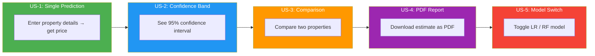
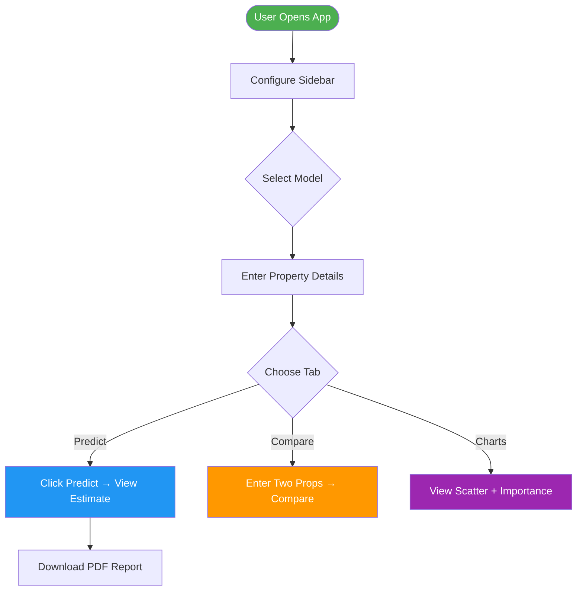

<![CDATA[

# 📋 Product Requirements Document (PRD)

### House Price Predictor — v1.0

---

## 1. Product Overview

| Field | Detail |
|-------|--------|
| **Product Name** | House Price Predictor |
| **Version** | 1.0.0 |
| **Author** | Subhadip Paul |
| **Date** | June 2026 |
| **Status** | ✅ Complete |

### Problem Statement

Estimating property prices in India requires consulting multiple brokers. This tool provides **instant, ML-powered price estimates** with confidence intervals.

---

## 2. User Stories

---

## 3. Feature Requirements

### Input Features

| # | Feature | Type | Range |
|---|---------|------|-------|
| 1 | Area (sq ft) | Numeric | 300 – 6,000 |
| 2 | Bedrooms | Integer | 1 – 10 |
| 3 | Bathrooms | Integer | 1 – 8 |
| 4 | Age (years) | Integer | 0 – 50 |
| 5 | Location | Categorical | Downtown / Urban / Suburban / Rural |

### Output Features

| # | Output | Description |
|---|--------|-------------|
| 1 | Estimated Price | Point estimate in Lakhs ₹ |
| 2 | Confidence Band | 95% CI lower & upper bounds |
| 3 | Model Metrics | R², MAE, RMSE, CV R² |
| 4 | PDF Report | Downloadable summary |

---

## 4. User Flow

---

## 5. Acceptance Criteria

| User Story | Criteria |
|------------|----------|
| US-1 | Displays numeric price ≥ 0 in Lakhs ₹ |
| US-2 | Shows lower/upper bound using 1.96 × residual_std |
| US-3 | Side-by-side columns with grouped bar chart |
| US-4 | PDF downloads with property details + metrics |
| US-5 | Radio button toggles model, prediction updates |

---

## 6. Non-Functional Requirements

| Requirement | Target |
|-------------|--------|
| Prediction Latency | < 500ms |
| Model R² | ≥ 0.89 |
| CV R² | ≥ 0.85 |
| Python | 3.10+ |

---

_PRD v1.0 — House Price Predictor_

]]>
