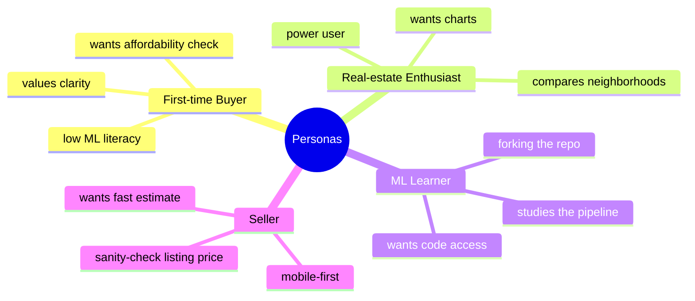
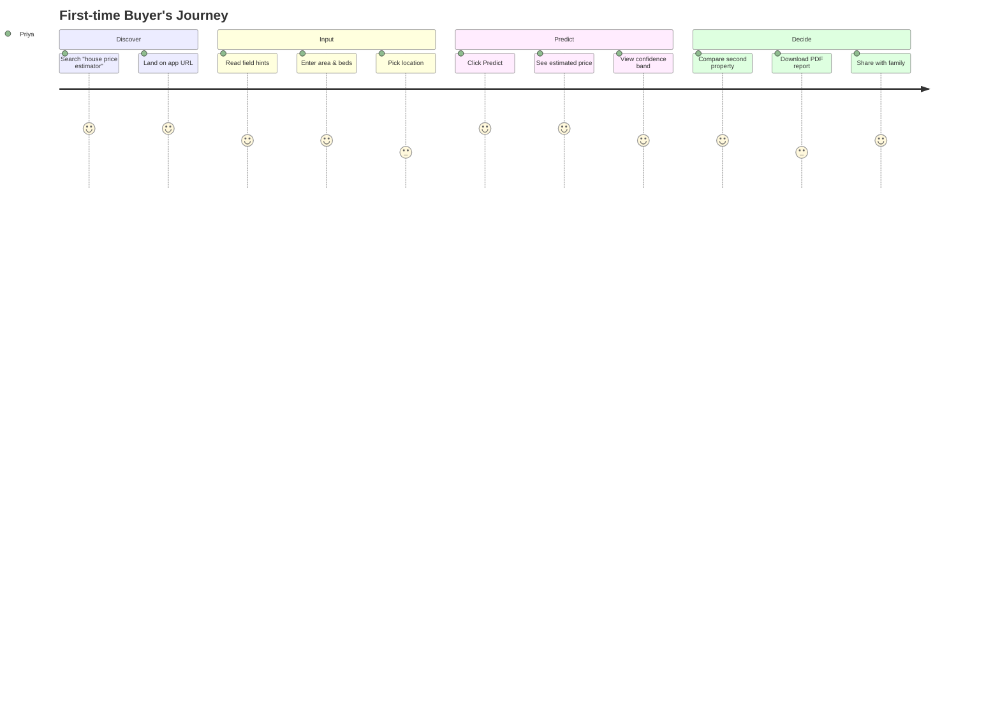
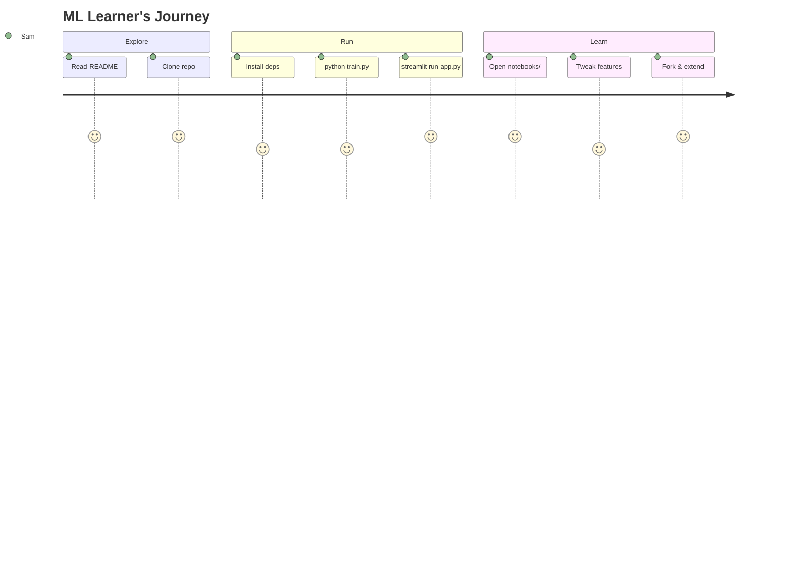
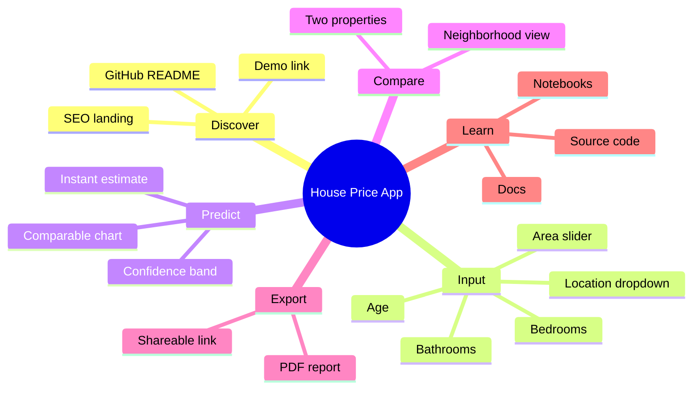
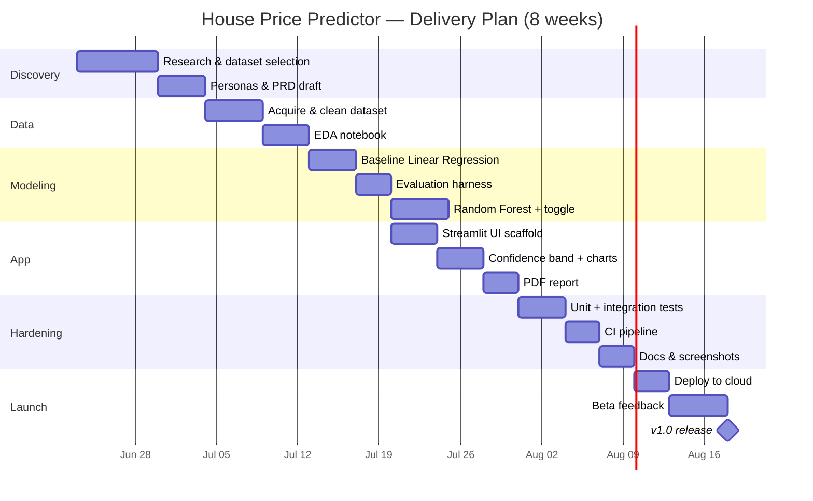
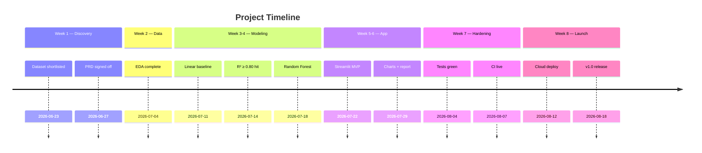
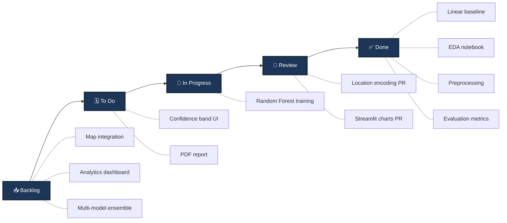
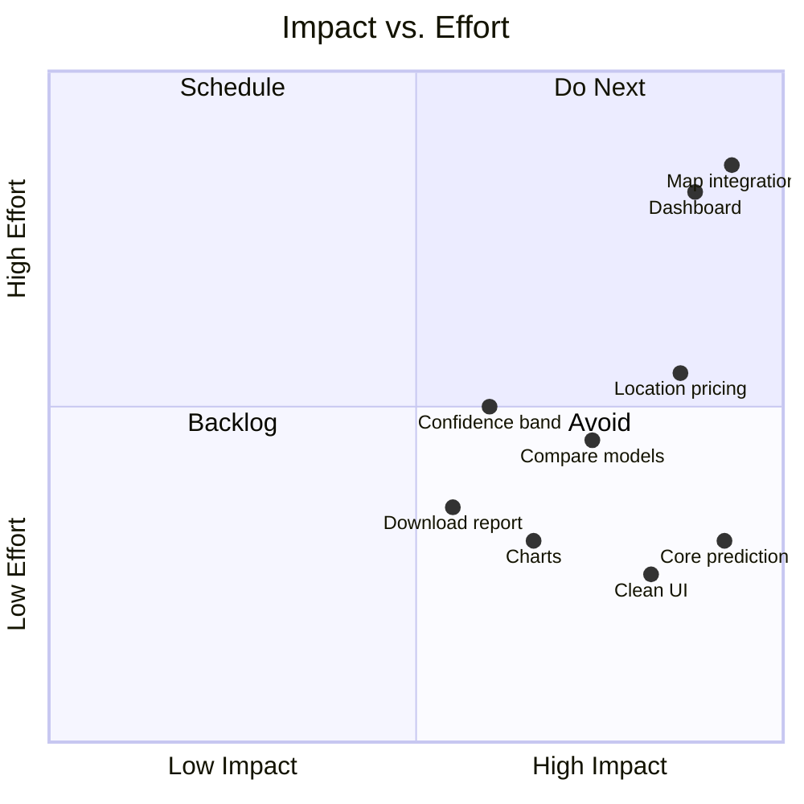
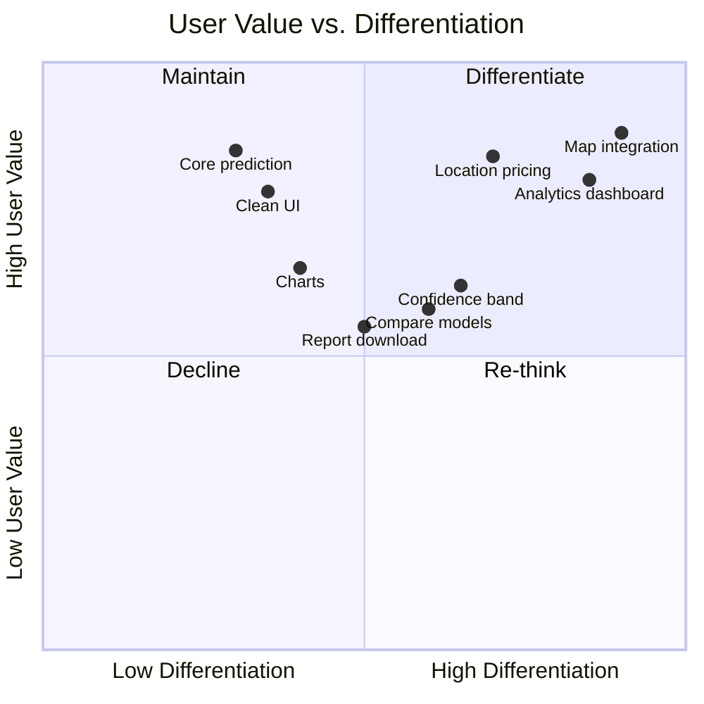
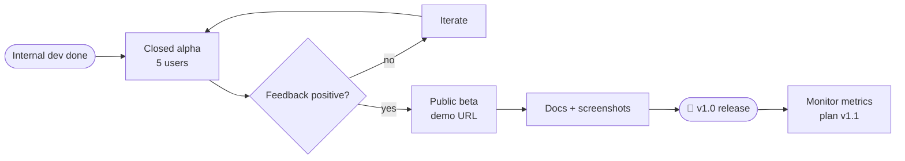

# 📋 PRD.md — Product Requirements Document

> **Product:** House Price Prediction App
> **Author:** Product Team
> **Status:** Draft v1.0
> **Last updated:** 2026-06-23

---

## 📑 Table of Contents

1. [Product Vision](#-product-vision)
2. [Target Users & Personas](#-target-users--personas)
3. [Problem Statement](#-problem-statement)
4. [Goals & Non-Goals](#-goals--non-goals)
5. [User Journey Diagram](#-user-journey-diagram)
6. [User Story Map / Mindmap](#-user-story-map--mindmap)
7. [Gantt Chart](#-gantt-chart)
8. [Project Timeline](#-project-timeline)
9. [Kanban Board](#-kanban-board)
10. [Feature Prioritization Quadrants](#-feature-prioritization-quadrants)
11. [Success Metrics](#-success-metrics)
12. [User Stories & Acceptance Criteria](#-user-stories--acceptance-criteria)
13. [Out of Scope](#-out-of-scope)
14. [Risks & Assumptions](#-risks--assumptions)
15. [Launch Plan](#-launch-plan)

---

## 🌅 Product Vision

> *Let anyone estimate a fair house price in seconds — no spreadsheets, no broker calls, no guesswork.*

The House Price Prediction App turns a handful of property details into a trustworthy price estimate, powered by a transparent machine-learning model and wrapped in a clean, friendly web UI.

---

## 👥 Target Users & Personas

| Persona | Goal | Pain we solve |
|---------|------|---------------|
| 🧑‍🎓 **First-time Buyer (Priya)** | Affordability check before viewing | Instant estimate + confidence band |
| 🏘️ **Enthusiast (Arjun)** | Compare 2-3 neighborhoods | Side-by-side comparison + charts |
| 🎓 **ML Learner (Sam)** | Study a clean end-to-end project | Open-source, documented pipeline |
| 🏠 **Seller (Meera)** | Validate her listing price | One-screen estimate in seconds |

---

## ❗ Problem Statement

Real-estate prices feel opaque. Buyers overpay, sellers underprice, and learners struggle to find a *complete* ML project they can run end-to-end. Existing tools are either black-box portals or fragmented tutorials.

**Why now?** Public datasets, mature libraries (scikit-learn, Streamlit), and free hosting make a transparent, runnable estimator achievable in days, not months.

---

## 🎯 Goals & Non-Goals

**Goals**
- Deliver an accurate (R² ≥ 0.80) price estimate from ≤ 6 inputs in < 3 seconds.
- Provide a one-command local setup and a public demo URL.
- Ship a documented, forkable codebase suitable as a portfolio project.

**Non-Goals**
- Not a brokerage or transaction platform.
- No user accounts or saved estimates in v1.
- No real-time market data feeds (v1 uses static dataset).

---

## 🛤️ User Journey Diagram

---

## 🗺️ User Story Map / Mindmap

---

## 📅 Gantt Chart

---

## 🗓️ Project Timeline

---

## 🧱 Kanban Board

**Current sprint snapshot**

| Backlog | To Do | In Progress | Review | Done |
|---------|-------|-------------|--------|------|
| Map integration | Confidence band UI | Random Forest training | Location encoding PR | Linear baseline |
| Analytics dashboard | PDF report | | Streamlit charts PR | EDA notebook |
| Multi-model ensemble | | | | Preprocessing |
| | | | | Evaluation metrics |

---

## 🎯 Feature Prioritization Quadrants

### Impact vs. Effort

### User Value vs. Differentiation

---

## 📏 Success Metrics

| Metric | Target | Measurement |
|--------|--------|-------------|
| Model R² | ≥ 0.80 | `train.py` eval output |
| Prediction latency | P95 < 200 ms | Streamlit logs |
| Demo monthly active users | ≥ 200 | Hosting analytics |
| GitHub stars (6 mo) | ≥ 50 | GitHub |
| Time-to-first-prediction | < 3 min from clone | Manual test |
| Test coverage | ≥ 80% | pytest/coverage CI |

---

## 📖 User Stories & Acceptance Criteria

**US-1 — Get a price estimate** *(Must)*
> As a buyer, I want to enter house details and see an estimated price.
- ✅ Inputs: area, beds, baths, age, location
- ✅ Result renders in < 1 s after click
- ✅ Price displayed in Lakh ₹ / Cr

**US-2 — See confidence** *(Should)*
> As a buyer, I want a confidence band so I trust the estimate.
- ✅ Shows ± range based on residual std
- ✅ Visible on chart

**US-3 — Compare properties** *(Should)*
> As an enthusiast, I want to compare two estimates side-by-side.
- ✅ Two input panels
- ✅ Comparison bar chart

**US-4 — Download report** *(Should)*
> As a seller, I want a PDF of the estimate.
- ✅ One-click PDF
- ✅ Includes inputs + estimate + date

**US-5 — Switch models** *(Could)*
> As a learner, I want to toggle Linear vs. Random Forest.
- ✅ Dropdown switches model
- ✅ Metric badge shown

**US-6 — Fork & extend** *(Could)*
> As an ML learner, I want clean docs to fork.
- ✅ README + notebooks + ARCHITECTURE.md

---

## 🚫 Out of Scope (v1)

- User accounts / saved history
- Real-time MLS / market data feeds
- In-app payments or referrals
- Mobile native apps (responsive web only)
- Multi-language UI

---

## ⚠️ Risks & Assumptions

| # | Risk / Assumption | Mitigation |
|---|-------------------|------------|
| 1 | Dataset coverage skews to one city → poor generalization | Disclose region; expand data in v2 |
| 2 | Users may treat estimate as appraisal | Prominent disclaimer |
| 3 | Model drift as markets change | Quarterly retraining schedule |
| 4 | Free-hosting scale limits | Plan migration to Fly.io if needed |
| 5 | Location categories unseen at inference | Fallback to city mean |

---

## 🚀 Launch Plan

**Launch checklist**

- [ ] R² ≥ 0.80 on held-out test set
- [ ] Inference P95 < 200 ms
- [ ] README + screenshots + demo GIF
- [ ] Public demo URL live
- [ ] LICENSE + CONTRIBUTING added
- [ ] GitHub release v1.0 tagged
