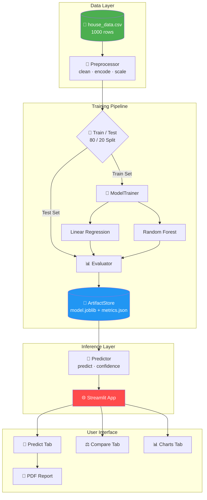
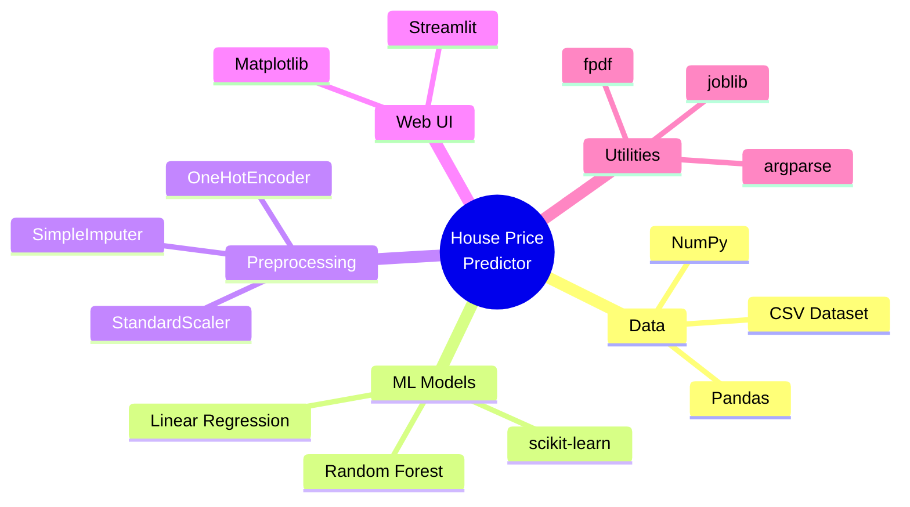

<](https://python.org)
[](https://streamlit.io)
[](https://scikit-learn.org)
[](LICENSE)
[]()

---

**Instantly estimate property prices** using Linear Regression and Random Forest models trained on **1,000 Indian real-estate samples**. Features include confidence intervals, property comparison, PDF reports, and interactive visualizations.

</div>

---

## 📑 Table of Contents

- [Features](#-features)
- [Architecture](#-architecture)
- [Tech Stack](#-tech-stack)
- [Project Structure](#-project-structure)
- [Model Performance](#-model-performance)
- [Screenshots](#-screenshots)
- [Quick Start](#-quick-start)
- [License](#-license)

---

## ✨ Features

| Feature | Description | Status |
|---------|-------------|--------|
| 🔮 **Single Prediction** | Predict house price from 5 input features | ✅ |
| 📊 **Confidence Interval** | 95% CI band on every prediction | ✅ |
| 🤖 **Model Switching** | Toggle between Linear Regression & Random Forest | ✅ |
| ⚖️ **Property Comparison** | Side-by-side comparison of two properties | ✅ |
| 📄 **PDF Report** | Download prediction report as PDF | ✅ |
| 📈 **Interactive Charts** | Area vs Price scatter + Feature Importance bar chart | ✅ |
| 🧹 **Data Preprocessing** | Missing value imputation, scaling, encoding | ✅ |
| 🔁 **Cross-Validation** | 5-fold CV to validate model generalization | ✅ |

---

## 🏗️ Architecture



---

## 🛠️ Tech Stack



---

## 📁 Project Structure

```
House Price Predictor/
├── app.py                  # Streamlit web UI (481 lines)
├── model.py                # ArtifactStore + Predictor classes
├── preprocess.py           # HouseData + Preprocessor classes
├── train.py                # Training pipeline + CLI
├── evaluate.py             # Evaluator — MAE, RMSE, R², residual std
├── generate_data.py        # Synthetic dataset generator (1000 rows)
├── requirements.txt        # Python dependencies
├── .gitignore              # Git ignore rules
│
├── data/
│   ├── house_data.csv      # Main dataset (1000 samples)
│   ├── processed/          # (generated at runtime)
│   └── raw/                # (raw data storage)
│
├── models/
│   ├── linear_regression/
│   │   └── <run_id>/
│   │       ├── model.joblib
│   │       └── metrics.json
│   └── random_forest/
│       └── <run_id>/
│           ├── model.joblib
│           └── metrics.json
│
├── notebooks/              # EDA notebooks (optional)
└── screenshots/            # UI screenshots
```

---

## 📊 Model Performance

### Metrics Comparison

| Metric | Linear Regression | Random Forest | Winner |
|--------|:-----------------:|:-------------:|:------:|
| **R² Score** | 0.9018 | **0.9313** | 🌲 RF |
| **MAE** | 19.38 L | **15.11 L** | 🌲 RF |
| **RMSE** | 24.82 L | **20.77 L** | 🌲 RF |
| **CV R² (mean)** | 0.8782 | **0.8816** | 🌲 RF |
| **Residual Std** | 24.87 L | **20.81 L** | 🌲 RF |
| **Training Samples** | 800 | 800 | — |
| **Test Samples** | 200 | 200 | — |

### Model Accuracy Visualization

```mermaid
xychart-beta
    title "Model Performance Comparison"
    x-axis ["R² Score", "CV R² Mean"]
    y-axis "Score" 0.85 --> 0.95
    bar [0.9018, 0.8782]
    bar [0.9313, 0.8816]
```



### Error Comparison

```mermaid
xychart-beta
    title "Error Metrics (Lower is Better)"
    x-axis ["MAE (Lakhs)", "RMSE (Lakhs)", "Residual Std"]
    y-axis "Value (Lakhs ₹)" 0 --> 30
    bar [19.38, 24.82, 24.87]
    bar [15.11, 20.77, 20.81]
```



---

## 🖼️ Screenshots

> _Run `streamlit run app.py` and capture screenshots to populate this section._

---

## 🚀 Quick Start

```bash
# 1. Clone the repo
git clone https://github.com/Subhadip-Paul2006/house_price_predictor.git
cd house_price_predictor

# 2. Create virtual environment
python -m venv venv
venv\Scripts\activate        # Windows
# source venv/bin/activate   # macOS/Linux

# 3. Install dependencies
pip install -r requirements.txt

# 4. Generate data (if needed)
python generate_data.py

# 5. Train models
python train.py

# 6. Launch the app
streamlit run app.py
```

---

## 📜 License

This project is open-source and available under the [MIT License](LICENSE).

---

<div align="center">

**Built with ❤️ using Python, scikit-learn, and Streamlit**

⭐ Star this repo if you found it useful!

</div>
]]>
