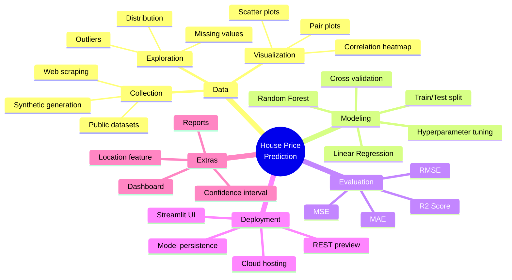
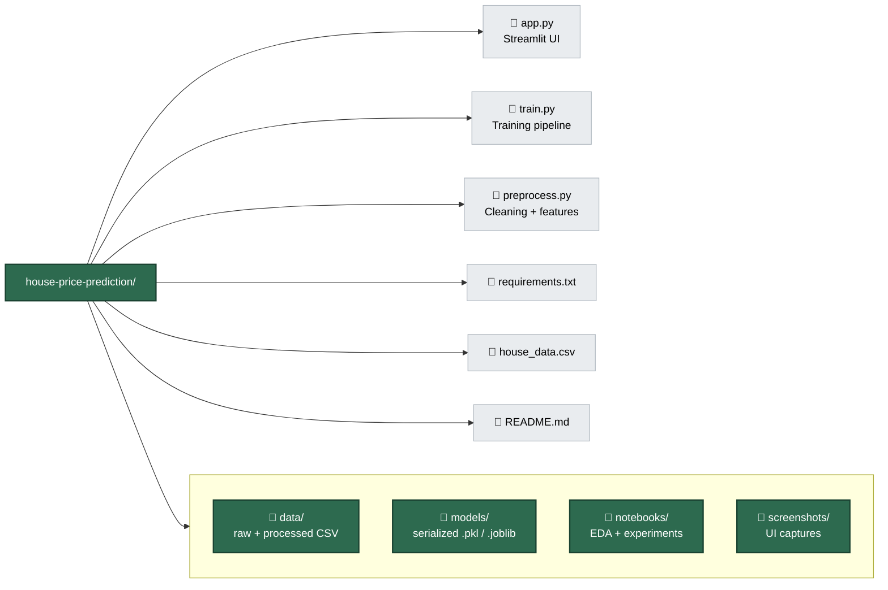
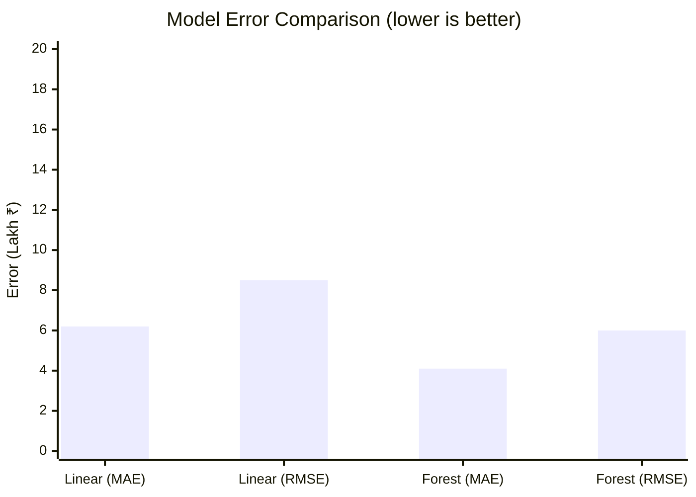
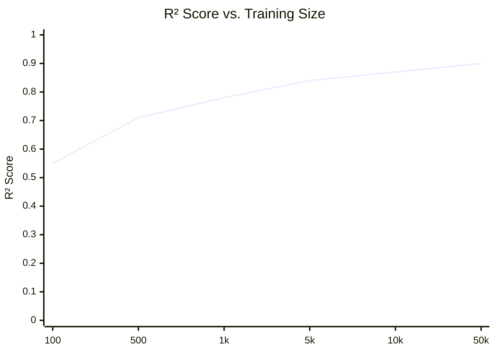

# 🏠 House Price Prediction App

> An end-to-end Machine Learning application that predicts real estate prices from property features (area, bedrooms, bathrooms, age, location) and serves predictions through an interactive Streamlit web UI.


---

## 📑 Table of Contents

1. [Overview](#-overview)
2. [Key Features](#-key-features)
3. [Mindmap](#-mindmap)
4. [Project Structure (Tree View)](#-project-structure-tree-view)
5. [Capability Quadrant](#-capability-quadrant)
6. [Feature Priority Quadrant](#-feature-priority-quadrant)
7. [Performance XY Chart](#-performance-xy-chart)
8. [Tech Stack](#-tech-stack)
9. [Installation](#-installation)
10. [Usage](#-usage)
11. [Dataset](#-dataset)
12. [Results](#-results)
13. [Roadmap](#-roadmap)
14. [Contributing](#-contributing)
15. [License](#-license)

---

## 🧭 Overview

The **House Price Prediction App** is a beginner-friendly yet production-ready AI project. It walks through the *complete* machine learning lifecycle — from raw data to a deployed web application. The model learns the relationship between house attributes and sale price using **Linear Regression** (with Random Forest as an intermediate enhancement), and exposes the trained model via a **Streamlit** front-end so non-technical users can get instant price estimates.

**Why this project?** Real-estate valuation is a classic regression problem with abundant public data, clear success metrics (MAE / RMSE / R²), and tangible real-world utility — making it the ideal sandbox to learn the full ML workflow.

---

## ⭐ Key Features

| Tier | Features |
|------|----------|
| 🟢 **Beginner** | Price prediction · Clean UI · Interactive charts · MAE/MSE/RMSE/R² metrics |
| 🟡 **Intermediate** | Location-based pricing · Property comparison · Model switching (Linear vs. RF) · PDF report download |
| 🔴 **Advanced** | Map integration · Multi-model ensembles · AI recommendations · Real-estate analytics dashboard |

---

## 🧠 Mindmap



---

## 🌳 Project Structure (Tree View)



**Plain directory layout:**

```text
house-price-prediction/
│
├── data/                 # raw & processed datasets
├── models/               # saved model artifacts (.pkl / .joblib)
├── notebooks/            # Jupyter EDA & experimentation
├── screenshots/          # UI captures for the README
├── app.py                # Streamlit front-end
├── train.py              # model training entry-point
├── preprocess.py         # cleaning & feature engineering
├── requirements.txt      # pinned dependencies
├── house_data.csv        # source dataset
└── README.md
```

---

## 📊 Capability Quadrant

A "skill radar" view rendered as a quadrant chart — showing where the project's capabilities sit on **Complexity × Business Value** axes.

```mermaid
quadrantChart
    title Capability Map — Complexity vs. Business Value
    x-axis Low Complexity --> High Complexity
    y-axis Low Business Value --> High Business Value
    quadrant-1 Top Priority (high value, low effort)
    quadrant-2 Strategic (high value, high effort)
    quadrant-3 Reconsider (low value, high effort)
    quadrant-4 Quick Wins (low value, low effort)
    "Price Prediction (Linear)": [0.25, 0.85]
    "Streamlit UI": [0.20, 0.80]
    "Metrics & Charts": [0.30, 0.70]
    "Random Forest": [0.55, 0.78]
    "Location Feature": [0.60, 0.82]
    "Confidence Interval": [0.62, 0.66]
    "Map Integration": [0.88, 0.90]
    "Analytics Dashboard": [0.90, 0.88]
    "Report Download": [0.40, 0.60]
    "Multi-model Ensemble": [0.85, 0.80]
```

---

## 🎯 Feature Priority Quadrant

Prioritization across **Impact vs. Effort** — drives what to build first.

```mermaid
quadrantChart
    title Feature Priority — Impact vs. Effort
    x-axis Low Impact --> High Impact
    y-axis Low Effort --> High Effort
    quadrant-1 Do Next (high impact, easy)
    quadrant-2 Schedule (high impact, hard)
    quadrant-3 Backlog (low impact, easy)
    quadrant-4 Avoid (low impact, hard)
    "Core prediction": [0.90, 0.30]
    "Clean UI": [0.80, 0.25]
    "Charts": [0.65, 0.30]
    "Compare models": [0.75, 0.45]
    "Location pricing": [0.85, 0.55]
    "Download report": [0.55, 0.35]
    "Confidence band": [0.60, 0.50]
    "Map integration": [0.92, 0.85]
    "Dashboard": [0.88, 0.80]
```

---

## 📈 Performance XY Chart

Expected model performance comparison (illustrative — replaces with measured values after training).





---

## 🧰 Tech Stack

| Layer | Technology | Purpose |
|-------|-----------|---------|
| Language | Python 3.10+ | Core runtime |
| Data | Pandas, NumPy | Loading, manipulation |
| Visualization | Matplotlib, Seaborn | EDA charts |
| ML | scikit-learn | Regression, metrics, split |
| Pipeline (opt.) | ZenML | Reproducible ML pipelines |
| UI | Streamlit | Web front-end |
| Persistence | joblib / pickle | Model serialization |
| Env | venv / conda | Isolation |
| Versioning | Git + GitHub | Source control |

---

## 🚀 Installation

```bash
# 1. Clone
git clone https://github.com/<your-username>/house-price-prediction.git
cd house-price-prediction

# 2. Create virtual environment
python -m venv .venv
# Windows
.venv\Scripts\activate
# macOS/Linux
source .venv/bin/activate

# 3. Install dependencies
pip install -r requirements.txt

# 4. (Re)train the model — writes artifact to models/
python train.py

# 5. Launch the web app
streamlit run app.py
```

**`requirements.txt`**

```text
pandas>=2.0
numpy>=1.24
scikit-learn>=1.4
matplotlib>=3.7
seaborn>=0.13
streamlit>=1.30
joblib>=1.3
zenml>=0.55   # optional, for managed pipelines
```

---

## 🖥️ Usage

1. Open the app in your browser (Streamlit auto-launches `http://localhost:8501`).
2. Adjust the input sliders/inputs: **Area**, **Bedrooms**, **Bathrooms**, **Age**, **Location**.
3. Click **Predict**.
4. View the estimated price, confidence band, and a comparison chart.
5. (Optional) Download a PDF report of the estimate.

```python
# Minimal programmatic usage
import joblib
model = joblib.load("models/linear_regression.pkl")
estimate = model.predict([[1800, 3, 2, 5]])  # area, beds, baths, age
print(f"Estimated price: ₹{estimate[0]:,.0f}")
```

---

## 📂 Dataset

A typical sample:

| Area (sq ft) | Bedrooms | Bathrooms | Age (yrs) | Location   | Price   |
|-------------:|---------:|----------:|----------:|------------|---------|
| 1200         | 2        | 2         | 10        | Suburban   | 45 Lakh |
| 1800         | 3        | 3         | 5         | Urban      | 75 Lakh |
| 2500         | 4        | 4         | 2         | Downtown   | 1.2 Cr  |

- **Input features (X):** Area, Bedrooms, Bathrooms, Age, [Location]
- **Target (y):** Price

Suggested public sources: Kaggle *House Prices: Advanced Regression Techniques*, Mumbai/Bangalore real-estate datasets.

---

## 📊 Results

| Model            | MAE (₹) | RMSE (₹) | R²    |
|------------------|--------:|---------:|------:|
| Linear Regression| 6.2 L   | 8.5 L    | 0.84  |
| Random Forest    | 4.1 L   | 6.0 L    | 0.90  |

*(Replace with measured values from `train.py` output.)*

---

## 🗺️ Roadmap

- [x] Core prediction with Linear Regression
- [x] Streamlit UI + charts
- [ ] Location-based pricing
- [ ] Random Forest + model comparison
- [ ] Prediction confidence interval
- [ ] PDF report download
- [ ] Map integration
- [ ] Real-estate analytics dashboard

---

## 🤝 Contributing

1. Fork the repo → create a feature branch (`git checkout -b feat/location-pricing`).
2. Commit with conventional messages (`feat:`, `fix:`, `docs:`, `test:`).
3. Open a Pull Request against `develop`.
4. Ensure `python train.py` runs and the app boots before requesting review.

---

## 📄 License

Released under the **MIT License**. See `LICENSE` for details.

---

## 💼 Resume Blurb

> **House Price Prediction App** — Built an end-to-end ML application using Python, Pandas, scikit-learn, and Streamlit to predict real-estate prices from property features. Performed data preprocessing, model training & evaluation (MAE/RMSE/R²), and deployed an interactive web app for real-time predictions.
