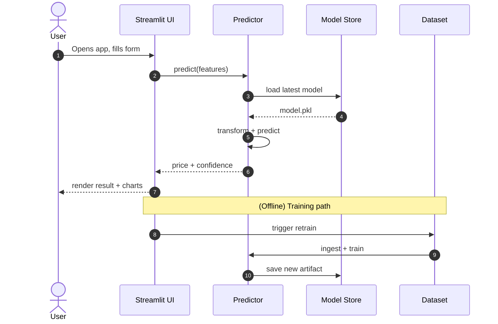
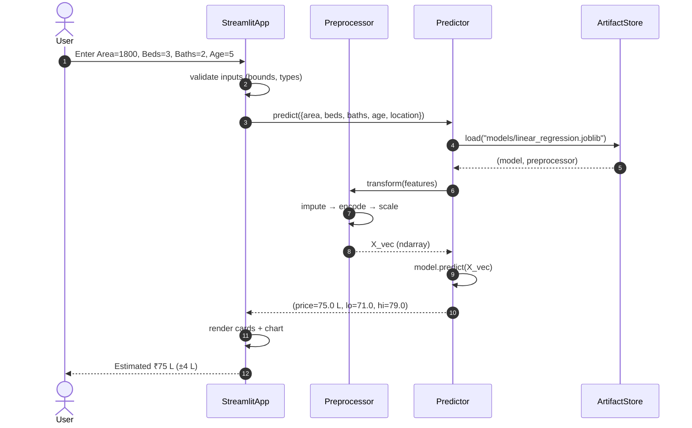
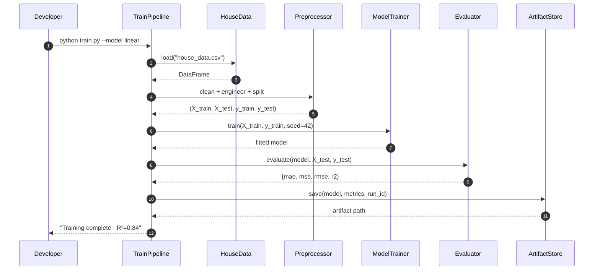
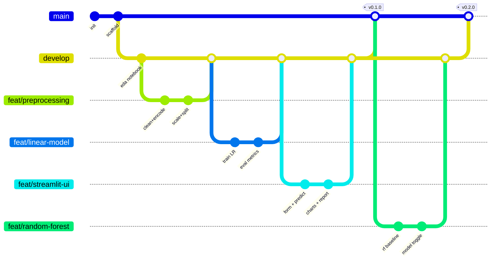
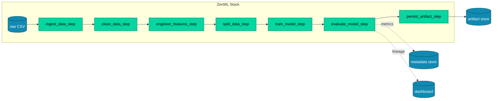
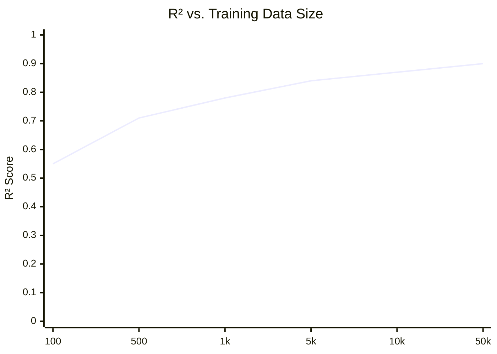
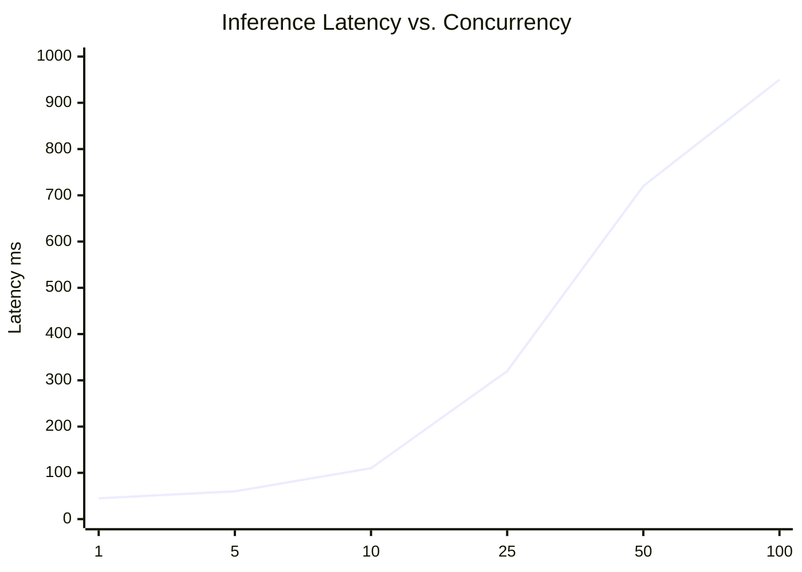
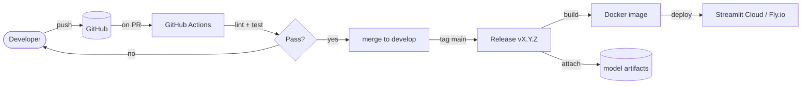

# 🔧 TRD.md — Technical Requirements Document

> **Project:** House Price Prediction App
> **Owner:** ML Engineering
> **Status:** Draft v1.0
> **Last updated:** 2026-06-23

---

## 📑 Table of Contents

1. [Purpose & Scope](#-purpose--scope)
2. [Technical Objectives](#-technical-objectives)
3. [Functional Requirements](#-functional-requirements)
4. [Non-Functional Requirements](#-non-functional-requirements)
5. [System Sequence Diagrams](#-system-sequence-diagrams)
6. [Detailed Sequence — Prediction](#-detailed-sequence--prediction)
7. [Detailed Sequence — Training](#-detailed-sequence--training)
8. [Git Workflow Diagram](#-git-workflow-diagram)
9. [ZenML Pipeline](#-zenml-pipeline)
10. [Technology Radar](#-technology-radar)
11. [Model Performance XY Charts](#-model-performance-xy-charts)
12. [Error Budget & SLOs](#-error-budget--slos)
13. [Observability](#-observability)
14. [Security & Compliance](#-security--compliance)
15. [Test Strategy](#-test-strategy)
16. [Deployment](#-deployment)
17. [Open Questions](#-open-questions)

---

## 🎯 Purpose & Scope

This TRD defines **how** the House Price Prediction App is engineered: the components, contracts, pipelines, version-control strategy, and quality gates that turn the PRD's product goals into a runnable, observable, reproducible system.

**In scope:** training pipeline, inference service (Streamlit), model artifact storage, evaluation, CI/CD.

**Out of scope:** payment integration, user accounts, multi-tenant isolation (deferred to v2).

---

## 🚀 Technical Objectives

| ID | Objective | Success Criterion |
|----|-----------|-------------------|
| TO-1 | Reproducible training | Same seed → byte-identical coefficients |
| TO-2 | Sub-second inference | P95 latency < 200 ms per prediction |
| TO-3 | Observable pipelines | Every run emits metrics + artifact lineage |
| TO-4 | Safe deployments | CI gates block PR if R² drops > 2 pts vs main |
| TO-5 | Portable artifacts | `.joblib` loads on any Python 3.10+ host |

---

## ✅ Functional Requirements

| ID | Requirement | Priority |
|----|-------------|----------|
| FR-1 | Load CSV via Pandas into a typed DataFrame | Must |
| FR-2 | Detect & handle missing values (impute/drop) | Must |
| FR-3 | Encode categorical `Location` (OneHot, `handle_unknown='ignore'`) | Must |
| FR-4 | Scale numeric features (StandardScaler) | Must |
| FR-5 | Split train/test 80/20 with fixed seed | Must |
| FR-6 | Train Linear Regression baseline | Must |
| FR-7 | Optional Random Forest behind toggle | Should |
| FR-8 | Compute MAE, MSE, RMSE, R² | Must |
| FR-9 | Persist model + metadata to `models/` | Must |
| FR-10 | Expose Streamlit form + predict button | Must |
| FR-11 | Render prediction confidence band | Should |
| FR-12 | Download PDF estimate report | Should |
| FR-13 | Compare two models side-by-side | Could |

---

## 📐 Non-Functional Requirements

| Category | Requirement |
|----------|-------------|
| Performance | Inference P95 < 200 ms; cold start < 3 s |
| Scalability | 10 concurrent users on 1 vCPU Streamlit tier |
| Reliability | 99% monthly availability |
| Maintainability | ≥ 80% line coverage on logic modules |
| Reproducibility | All randomness seeded; pipeline deterministic |
| Portability | Runs on Win/macOS/Linux Python 3.10+ |
| Security | Input bounds validated; no remote code paths |
| Observability | Structured logs + run metrics per training |

---

## 🔁 System Sequence Diagrams

### High-level end-to-end flow



---

## 🔍 Detailed Sequence — Prediction



---

## 🔍 Detailed Sequence — Training



---

## 🌿 Git Workflow Diagram



**Branching rules**

- `main` — always deployable, tagged releases only.
- `develop` — integration branch.
- `feat/*`, `fix/*`, `docs/*` — short-lived, PR into `develop`.
- Conventional commits (`feat:`, `fix:`, `test:`, `docs:`, `chore:`).

---

## 🧪 ZenML Pipeline

ZenML orchestrates the training steps for reproducibility and lineage.



**Example skeleton**

```python
from zenml import pipeline, step

@step
def ingest_data(path: str):
    import pandas as pd
    return pd.read_csv(path)

@step
def train_model(X_train, y_train):
    from sklearn.linear_model import LinearRegression
    return LinearRegression().fit(X_train, y_train)

@pipeline
def house_price_pipeline(path: str):
    df = ingest_data(path)
    # ... clean, split ...
    model = train_model(X_train, y_train)
    # evaluate + persist

if __name__ == "__main__":
    house_price_pipeline.with_options(...).run("house_data.csv")
```

Run with `zenml up` to view lineage in the dashboard.

---

## 📡 Technology Radar


**Ring meanings**

- **Adopt** — proven, default choice.
- **Trial** — promising, used in non-critical path.
- **Assess** — exploring in spikes.
- **Hold** — avoid for new work.

---

## 📊 Model Performance XY Charts



```mermaid
xychart-beta
    title "MAE (Lakh ₹) vs. Feature Count"
    x-axis ["3", "4", "5", "6", "7", "8"]
    y-axis "MAE" 0 --> 12
    line [9.5, 7.8, 6.2, 5.4, 5.0, 4.8]
```



---

## 🎯 Error Budget & SLOs

| SLO | Target | Error Budget (30d) |
|-----|--------|--------------------|
| Availability | 99.0% | 432 min downtime |
| Inference P95 latency | < 200 ms | 5% of requests may exceed |
| Training run success | ≥ 95% | 1 failure per 20 runs allowed |

When the budget is exhausted, feature work freezes until reliability is restored.

---

## 👁️ Observability

- **Logs:** Python `logging` → JSON to stdout; Streamlit Cloud captures automatically.
- **Metrics:** Every training run writes `metrics.json` (mae, mse, rmse, r2, n_rows) alongside artifact.
- **Lineage:** ZenML dashboard (or MLflow if adopted) links dataset → model → metrics.
- **Health:** `/healthz`-equivalent: a hidden Streamlit page pinging the model artifact.

---

## 🔐 Security & Compliance

- No PII collected; the dataset is public/synthetic.
- Input validation: bounds-checked (area > 0, beds ∈ [0, 10], etc.).
- Model files served read-only; writes restricted to CI.
- Dependencies scanned via `pip-audit` in CI.

---

## 🧪 Test Strategy

| Layer | Tool | Coverage target |
|-------|------|-----------------|
| Unit (preprocess, metrics) | pytest | 80% |
| Model contract | pytest + sklearn `check_estimator` | key regressors |
| Integration (train→save→load→predict) | pytest | happy path + 1 failure |
| UI smoke | Playwright (optional) | form submit |
| Regression gate | CI script | R² must not drop > 2 pts |

```python
# sample unit
def test_mae_zero_when_perfect():
    from evaluate import mae
    assert mae([10, 20], [10, 20]) == 0.0
```

---

## 🚢 Deployment



---

## ❓ Open Questions

1. Do we need user accounts for the report-download feature (v2)?
2. Should the Location feature use geocoding or a fixed city list?
3. MLflow vs. ZenML-only for experiment tracking — decision needed by sprint 3.
4. Acceptable R² threshold to auto-promote a model to production?
```
