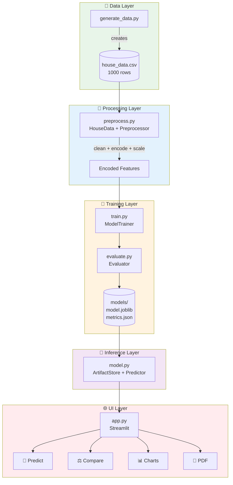
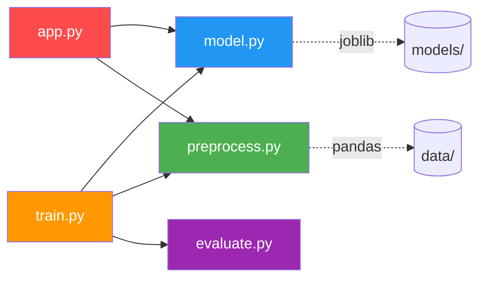
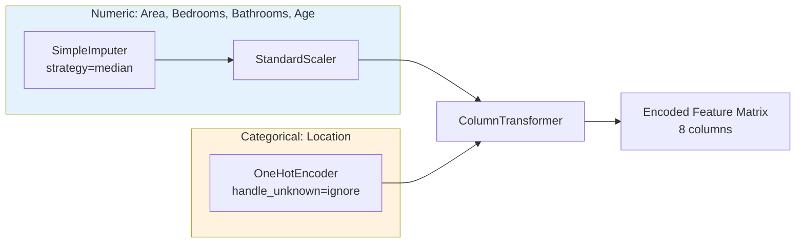

<![CDATA[<div align="center">

# 🔧 Technical Requirements Document (TRD)

### House Price Predictor — v1.0

</div>

---

## 1. System Architecture



---

## 2. Module Dependency Graph



---

## 3. Data Schema

### 3.1 Raw Dataset (`house_data.csv`)

| Column | Type | Range | Nullable | Description |
|--------|------|-------|----------|-------------|
| Area | float | 500–5000 | 2% NaN | Built-up area (sq ft) |
| Bedrooms | float | 1–6 | 1% NaN | Number of bedrooms |
| Bathrooms | int | 1–5 | No | Number of bathrooms |
| Age | int | 0–50 | No | Property age (years) |
| Location | str | 4 categories | 1.5% NaN | Downtown/Urban/Suburban/Rural |
| Price | float | ≥ 5 L | No | Target variable (Lakhs ₹) |

### 3.2 Encoding Pipeline



---

## 4. ML Model Specifications

### 4.1 Algorithms

| Parameter | Linear Regression | Random Forest |
|-----------|:-----------------:|:-------------:|
| **Class** | `LinearRegression()` | `RandomForestRegressor` |
| n_estimators | — | 200 |
| max_depth | — | 20 |
| random_state | — | 42 |
| Train/Test | 80/20 | 80/20 |
| CV Folds | 5 | 5 |

### 4.2 Metrics

| Metric | Linear Regression | Random Forest |
|--------|:-----------------:|:-------------:|
| R² | 0.9018 | **0.9313** |
| MAE | 19.38 L | **15.11 L** |
| RMSE | 24.82 L | **20.77 L** |
| CV R² | 0.8782 | **0.8816** |
| Residual Std | 24.87 L | **20.81 L** |

---

## 5. Training Pipeline


---

## 6. Artifact Storage

```
models/
├── linear_regression/
│   └── 20260624_145024/
│       ├── model.joblib      # LinearRegression + Preprocessor bundle
│       └── metrics.json      # {mae, mse, rmse, r2, residual_std, ...}
└── random_forest/
    └── 20260624_145030/
        ├── model.joblib      # RandomForest + Preprocessor bundle (14.6 MB)
        └── metrics.json
```

---

## 7. API Reference

### `Predictor.predict(features: dict) → float`

Returns the predicted price in Lakhs ₹.

### `Predictor.confidence(features: dict) → Tuple[float, float, float]`

Returns `(price, lower_bound, upper_bound)` with 95% CI.

### `ArtifactStore.save(model, preprocessor, metrics, algorithm_name) → str`

Persists model bundle and metrics to disk. Returns artifact directory path.

### `ArtifactStore.load(algorithm_name, run_id=None) → Tuple`

Loads the latest or specified run. Returns `(model, preprocessor, metrics)`.

---

## 8. Dependencies

| Package | Version | Purpose |
|---------|---------|---------|
| pandas | ≥ 2.0 | Data handling |
| numpy | ≥ 1.24 | Numerical ops |
| scikit-learn | ≥ 1.4 | ML models + preprocessing |
| joblib | ≥ 1.3 | Model persistence |
| matplotlib | ≥ 3.7 | Charting |
| seaborn | ≥ 0.13 | Statistical plots |
| streamlit | ≥ 1.30 | Web UI |
| fpdf | ≥ 1.7.2 | PDF generation |

---

<div align="center">

_TRD v1.0 — House Price Predictor_

</div>
]]>
