# 📖 USAGE GUIDE

### House Price Predictor — Complete Setup & Contribution Guide

[](https://github.com/Subhadip-Paul2006/house_price_predictor/fork)
[](https://pip.pypa.io)
[](https://streamlit.io)
[](https://github.com/Subhadip-Paul2006/house_price_predictor/pulls)

</div>

---

## 📑 Table of Contents

- [Overview Workflow](#-overview-workflow)
- [Step 1 — Fork the Repository](#-step-1--fork-the-repository)
- [Step 2 — Install Virtual Environment & Packages](#-step-2--install-virtual-environment--packages)
- [Step 3 — Run the Project](#-step-3--run-the-project)
- [Step 4 — How Others Can Contribute](#-step-4--how-others-can-contribute)
- [Troubleshooting](#-troubleshooting)
- [Project Architecture Quick Reference](#-project-architecture-quick-reference)

---

## 🔄 Overview Workflow

The complete journey from forking to contributing:


---

## 🍴 Step 1 — Fork the Repository

### What is Forking?

Forking creates your own copy of the repository on GitHub, so you can experiment freely without affecting the original project.

### Fork Workflow

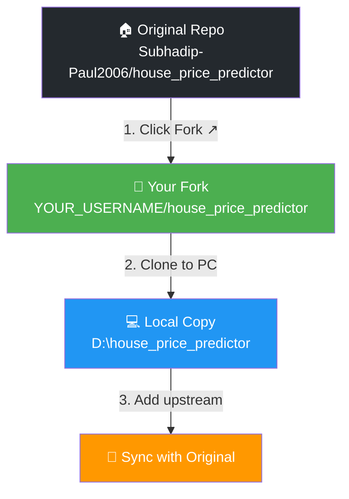

### 1.1 — Fork on GitHub

1. Go to the repository: **[github.com/Subhadip-Paul2006/house_price_predictor](https://github.com/Subhadip-Paul2006/house_price_predictor)**
2. Click the **Fork** button (top-right corner)
3. Select your GitHub account as the destination
4. Wait for GitHub to create your fork

### 1.2 — Clone Your Fork Locally

```bash
# Replace YOUR_USERNAME with your GitHub username
git clone https://github.com/YOUR_USERNAME/house_price_predictor.git

# Navigate into the project directory
cd house_price_predictor
```

### 1.3 — Add Upstream Remote (for staying in sync)

```bash
# Link to the original repo so you can pull future updates
git remote add upstream https://github.com/Subhadip-Paul2006/house_price_predictor.git

# Verify remotes
git remote -v
```

**Expected output:**

```
origin    https://github.com/YOUR_USERNAME/house_price_predictor.git (fetch)
origin    https://github.com/YOUR_USERNAME/house_price_predictor.git (push)
upstream  https://github.com/Subhadip-Paul2006/house_price_predictor.git (fetch)
upstream  https://github.com/Subhadip-Paul2006/house_price_predictor.git (push)
```

### 1.4 — Sync Your Fork (anytime)

```bash
git fetch upstream
git checkout main
git merge upstream/main
git push origin main
```

---

## 🐍 Step 2 — Install Virtual Environment & Packages

### Why a Virtual Environment?

Virtual environments isolate your project's Python packages from the system-wide installation, preventing version conflicts.

### Environment Setup Flow

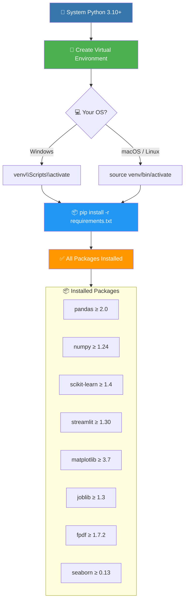

### 2.1 — Check Python Version

```bash
python --version
# Required: Python 3.10 or higher
```

> **⚠️ Note:** If you have both `python` and `python3`, use `python3` on macOS/Linux.

### 2.2 — Create Virtual Environment

```bash
# Create a virtual environment named 'venv'
python -m venv venv
```

### 2.3 — Activate the Virtual Environment

| OS | Command |
|----|---------|
| **Windows (CMD)** | `venv\Scripts\activate` |
| **Windows (PowerShell)** | `.\venv\Scripts\Activate.ps1` |
| **macOS / Linux** | `source venv/bin/activate` |

After activation, your terminal prompt will show `(venv)`:

```
(venv) D:\house_price_predictor>
```

### 2.4 — Install Dependencies

```bash
pip install -r requirements.txt
```

### Package Dependency Map

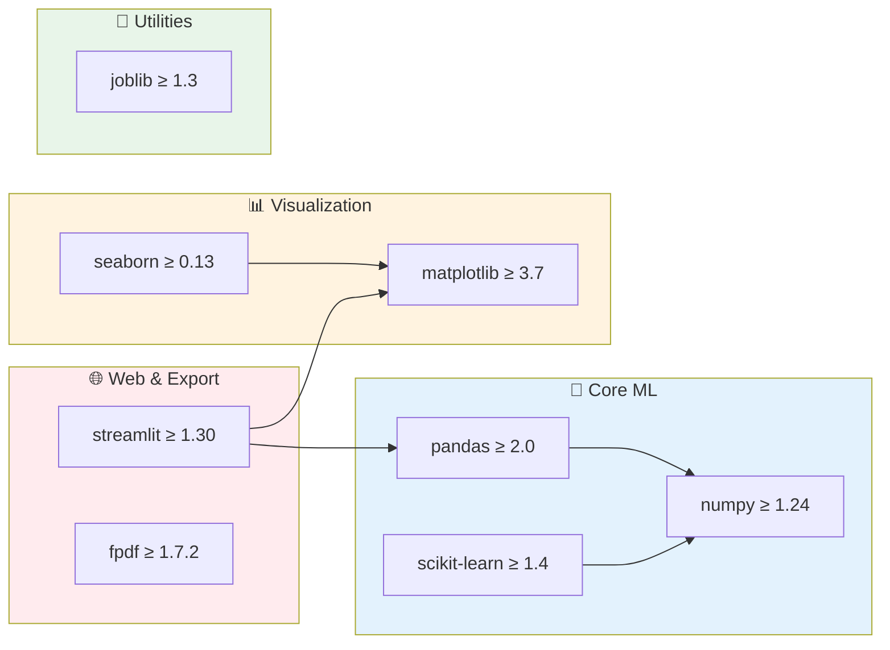

### 2.5 — Verify Installation

```bash
python -c "import streamlit, sklearn, pandas, matplotlib, fpdf; print('All packages installed successfully!')"
```

---

## 🚀 Step 3 — Run the Project

### Execution Pipeline

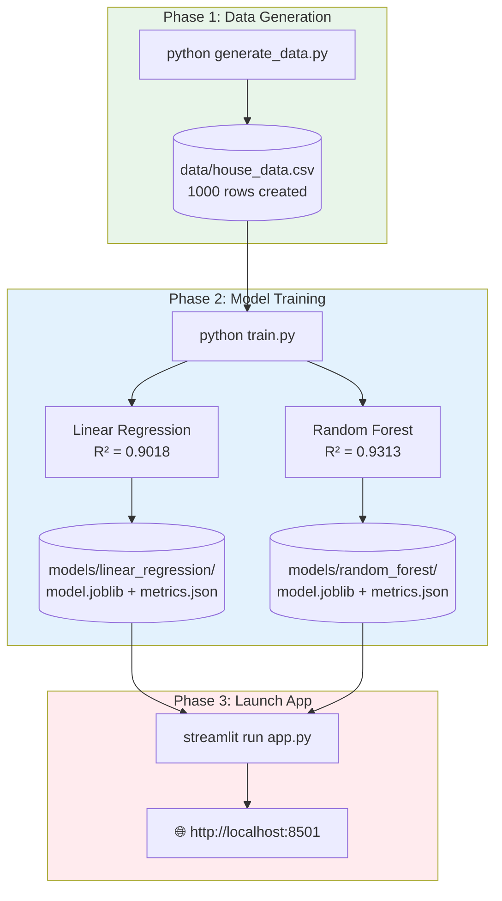

### 3.1 — Generate the Dataset

> Skip this if `data/house_data.csv` already exists.

```bash
python generate_data.py
```

**Expected output:**

```
✅ Generated 1000 rows → data/house_data.csv
   Missing values:
Area         20
Bedrooms     10
Bathrooms     0
Age           0
Location     15
Price         0
```

### 3.2 — Train the Models

```bash
# Train BOTH models (Linear Regression + Random Forest)
python train.py

# Or train a specific model:
python train.py --model linear_regression
python train.py --model random_forest
```

**Expected training output:**

```
📊 Random Forest — Results
   Training samples : 800
   Test samples     : 200
   MAE              : 15.11 Lakh
   RMSE             : 20.77 Lakh
   R² (test)        : 0.9313
   R² (CV mean)     : 0.8816 ± 0.0352
   Residual Std     : 20.81 Lakh
```

### Training Pipeline Stages

```mermaid
flowchart LR
    S1["1️⃣ Load<br/>CSV"] --> S2["2️⃣ Clean<br/>Impute NaN"]
    S2 --> S3["3️⃣ Engineer<br/>Features"]
    S3 --> S4["4️⃣ Split<br/>80/20"]
    S4 --> S5["5️⃣ Encode<br/>Scale"]
    S5 --> S6["6️⃣ Train<br/>Model"]
    S6 --> S7["7️⃣ Cross<br/>Validate"]
    S7 --> S8["8️⃣ Evaluate<br/>Test Set"]
    S8 --> S9["9️⃣ Save<br/>Artifacts"]

    style S1 fill:#4CAF50,color:#fff
    style S2 fill:#4CAF50,color:#fff
    style S3 fill:#4CAF50,color:#fff
    style S4 fill:#2196F3,color:#fff
    style S5 fill:#2196F3,color:#fff
    style S6 fill:#FF9800,color:#fff
    style S7 fill:#FF9800,color:#fff
    style S8 fill:#9C27B0,color:#fff
    style S9 fill:#9C27B0,color:#fff
```

### 3.3 — Launch the Streamlit App

```bash
streamlit run app.py
```

**The app will open in your browser at `http://localhost:8501`.**

### App Features Overview

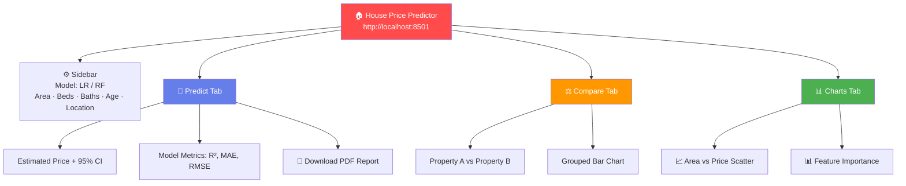

### 3.4 — Model Performance Summary

| Metric | Linear Regression | Random Forest |
|--------|:-----------------:|:-------------:|
| **R² Score** | 0.9018 | **0.9313** ✅ |
| **MAE** | 19.38 L | **15.11 L** ✅ |
| **RMSE** | 24.82 L | **20.77 L** ✅ |
| **CV R²** | 0.8782 | **0.8816** ✅ |

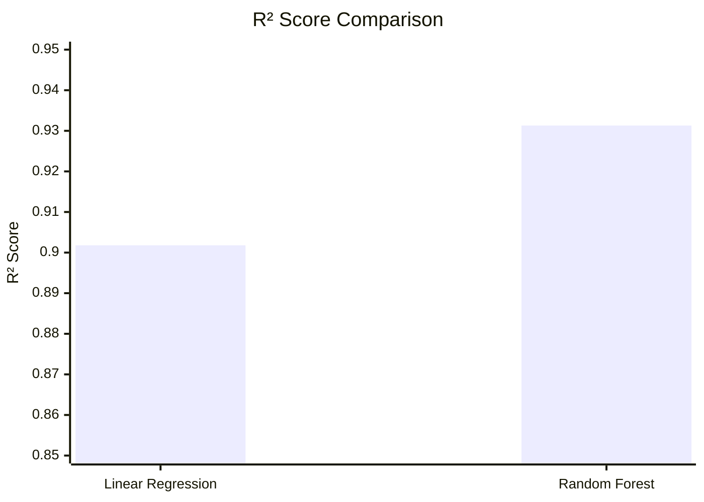

```mermaid
xychart-beta
    title "Error Comparison (Lower = Better)"
    x-axis ["MAE (Lakhs)", "RMSE (Lakhs)"]
    y-axis "Value" 0 --> 30
    bar [19.38, 24.82]
    bar [15.11, 20.77]
```

---

## 🤝 Step 4 — How Others Can Contribute

### Contribution Workflow

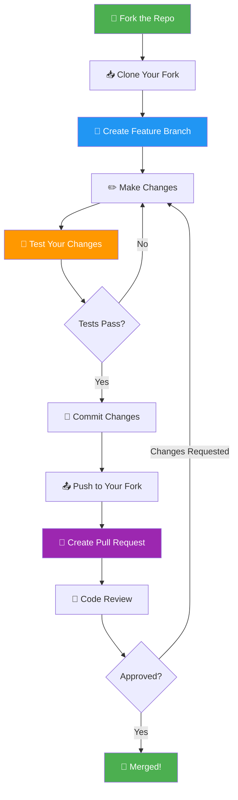

### 4.1 — Create a Feature Branch

**Never work directly on `main`.** Always create a feature branch:

```bash
# Create and switch to a new branch
git checkout -b feature/your-feature-name

# Examples:
git checkout -b feature/add-gradient-boosting
git checkout -b fix/prediction-error
git checkout -b docs/update-readme
```

### Branch Naming Convention

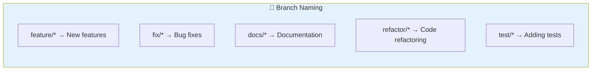

| Type | Pattern | Example |
|------|---------|---------|
| New Feature | `feature/description` | `feature/add-xgboost` |
| Bug Fix | `fix/description` | `fix/negative-price` |
| Documentation | `docs/description` | `docs/add-api-guide` |
| Refactor | `refactor/description` | `refactor/preprocess-pipeline` |
| Tests | `test/description` | `test/add-unit-tests` |

### 4.2 — Make Your Changes

Some ideas for contributions:

| Category | Idea | Difficulty |
|----------|------|:----------:|
| 🤖 **New Model** | Add XGBoost or Gradient Boosting | ⭐⭐ |
| 📊 **Visualization** | Add correlation heatmap | ⭐ |
| 🧪 **Testing** | Add pytest unit tests | ⭐⭐ |
| 📓 **Notebook** | Add EDA Jupyter notebook | ⭐ |
| 🎨 **UI** | Add dark mode toggle | ⭐⭐ |
| 📈 **Feature** | Add price trend over age chart | ⭐ |
| 🌐 **Deploy** | Deploy on Streamlit Cloud | ⭐⭐ |
| 📄 **Docs** | Improve inline docstrings | ⭐ |

### 4.3 — Test Your Changes

```bash
# 1. Verify the data pipeline still works
python generate_data.py

# 2. Verify training completes successfully
python train.py

# 3. Verify the app starts without errors
streamlit run app.py
```

### 4.4 — Commit and Push

```bash
# Stage your changes
git add .

# Commit with a descriptive message
git commit -m "feat: add XGBoost model support"

# Push to your fork
git push origin feature/your-feature-name
```

### Commit Message Format

| Prefix | Usage |
|--------|-------|
| `feat:` | New feature |
| `fix:` | Bug fix |
| `docs:` | Documentation only |
| `refactor:` | Code refactoring |
| `test:` | Adding/updating tests |
| `style:` | Formatting, no code change |

### 4.5 — Create a Pull Request

1. Go to your fork on GitHub
2. Click **"Compare & pull request"**
3. Fill in the PR template:
   - **Title:** Clear, descriptive title
   - **Description:** What you changed and why
   - **Testing:** How you verified your changes
4. Submit the PR

### Pull Request Lifecycle

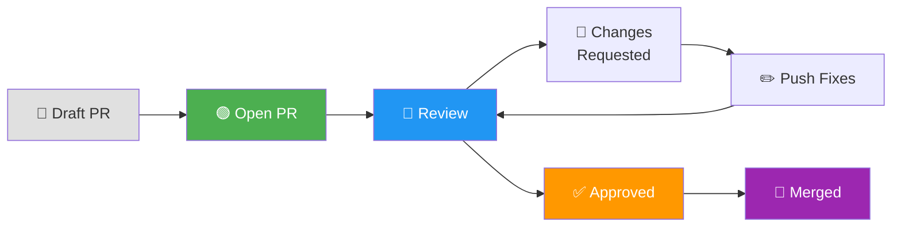

---

## 🔧 Troubleshooting

### Common Issues & Fixes

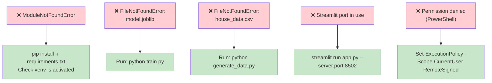

| Problem | Solution |
|---------|----------|
| `ModuleNotFoundError` | Ensure venv is activated and run `pip install -r requirements.txt` |
| `FileNotFoundError: model.joblib` | Run `python train.py` to train models first |
| `FileNotFoundError: house_data.csv` | Run `python generate_data.py` to generate dataset |
| Streamlit port already in use | Use `streamlit run app.py --server.port 8502` |
| PowerShell script execution disabled | Run `Set-ExecutionPolicy -Scope CurrentUser RemoteSigned` |
| `venv\Scripts\activate` not recognized | Use `.\venv\Scripts\Activate.ps1` in PowerShell |

---

## 🏗️ Project Architecture Quick Reference

### File Responsibilities

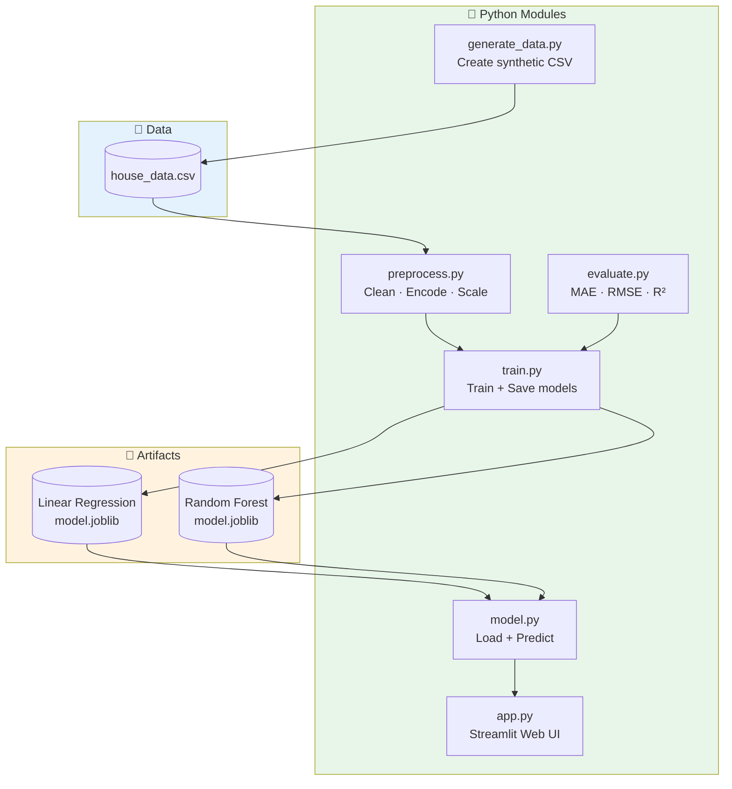

### Quick Command Reference

| Action | Command |
|--------|---------|
| Generate data | `python generate_data.py` |
| Train all models | `python train.py` |
| Train specific model | `python train.py --model random_forest` |
| Launch app | `streamlit run app.py` |
| Deactivate venv | `deactivate` |

---

<div align="center">

### 🌟 Thank you for using & contributing to House Price Predictor!

**Questions?** Open an [issue](https://github.com/Subhadip-Paul2006/house_price_predictor/issues) on GitHub.

---

_USAGE.md v1.0 — Last updated: June 2026_

</div>
]]>
