# 📘 Project Summary — Learning Guide

### _Understanding how to run & train this AI-generated House Price Predictor_

> **This is your personal cheat-sheet.** It won't be pushed to GitHub (it's in `.gitignore`).

</div>

---

## 📑 Table of Contents

- [Big Picture — What Does This Project Do?](#-big-picture--what-does-this-project-do)
- [File-by-File Breakdown](#-file-by-file-breakdown)
- [How to Run the Project (Step by Step)](#-how-to-run-the-project-step-by-step)
- [How Model Training Actually Works](#-how-model-training-actually-works)
- [Key ML Concepts You Should Know](#-key-ml-concepts-you-should-know)
- [Experiment: Modify & Re-Train](#-experiment-modify--re-train)
- [Quick Reference Card](#-quick-reference-card)

---

## 🎯 Big Picture — What Does This Project Do?

This project predicts **house prices** (in Lakhs ₹) based on 5 input features using machine learning. Here's the entire flow at a glance:

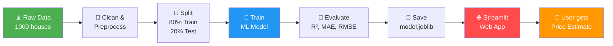

**In simple words:**
1. We have data about 1000 houses (area, bedrooms, bathrooms, age, location, price)
2. We clean that data (fix missing values)
3. We teach an ML model to learn the pattern: _"given these features → this is the price"_
4. We save the trained model to disk
5. A web app loads the model and lets users enter property details to get instant predictions

---

## 📂 File-by-File Breakdown

Here's what each file does — read these in order to understand the whole project:

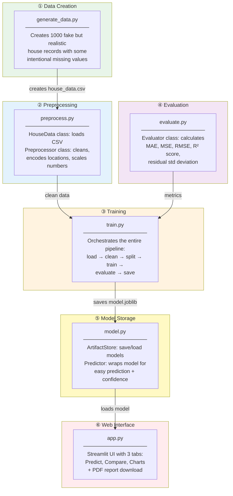

| # | File | Purpose | Read it to learn about... |
|---|------|---------|---------------------------|
| 1 | `generate_data.py` | Creates the dataset | How synthetic data is made with NumPy |
| 2 | `preprocess.py` | Cleans & transforms data | Imputation, OneHotEncoder, StandardScaler, ColumnTransformer |
| 3 | `evaluate.py` | Calculates metrics | MAE, RMSE, R² — what they mean |
| 4 | `train.py` | Runs the full pipeline | How everything connects end-to-end |
| 5 | `model.py` | Saves & loads models | joblib serialization, inference wrapper |
| 6 | `app.py` | Web UI | Streamlit components, matplotlib charts |

---

## 🚀 How to Run the Project (Step by Step)

### The 3 Commands You Need

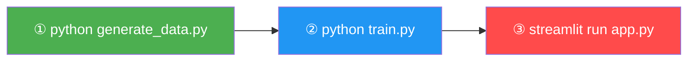

### Detailed Walkthrough

#### Step 0 — Set Up Your Environment (one-time only)

```bash
# Create a virtual environment (isolated Python)
python -m venv venv

# Activate it
venv\Scripts\activate              # Windows CMD
.\venv\Scripts\Activate.ps1        # Windows PowerShell
source venv/bin/activate           # macOS / Linux

# Install all required packages
pip install -r requirements.txt
```

> **What is `venv`?**  It's a folder that contains its own Python and pip. Packages you install go _inside_ this folder, so they don't mess up your system Python. Always activate it before running anything.

#### Step 1 — Generate the Dataset

```bash
python generate_data.py
```

**What happens behind the scenes:**

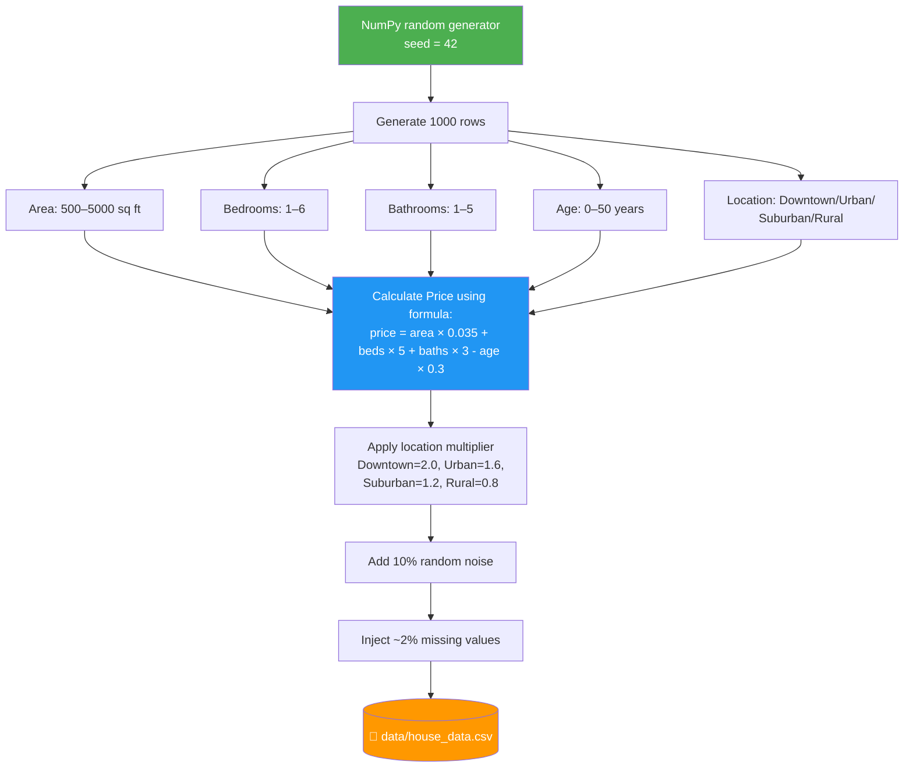

**You should see:**
```
✅ Generated 1000 rows → data/house_data.csv
   Missing values:
Area         20
Bedrooms     10
Location     15
```

> **Why inject missing values?** To simulate real-world messy data, so the preprocessing pipeline has something to clean.

---

#### Step 2 — Train the Models

```bash
python train.py              # trains BOTH models
python train.py --model random_forest    # train only Random Forest
python train.py --model linear_regression  # train only Linear Regression
```

**What happens behind the scenes (9-step pipeline):**

```mermaid
flowchart TD
    S1["STEP 1 — Load CSV<br/>━━━━━━━━━━━━━━━<br/>HouseData.load() reads<br/>data/house_data.csv<br/>into a pandas DataFrame"]
    
    S2["STEP 2 — Clean Data<br/>━━━━━━━━━━━━━━━<br/>• Drop rows where Price is NaN<br/>• Fill missing Area/Bedrooms with median<br/>• Fill missing Location with mode"]
    
    S3["STEP 3 — Engineer Features<br/>━━━━━━━━━━━━━━━<br/>• Price_Per_SqFt = Price / Area<br/>• Age_Bucket = New/Modern/Old/Very_Old<br/>• BedBath_Ratio = Bedrooms / Bathrooms"]
    
    S4["STEP 4 — Split Data<br/>━━━━━━━━━━━━━━━<br/>80% → Training set (800 rows)<br/>20% → Test set (200 rows)<br/>seed = 42 for reproducibility"]
    
    S5["STEP 5 — Encode & Scale<br/>━━━━━━━━━━━━━━━<br/>• Numeric cols → StandardScaler<br/>  (mean=0, std=1)<br/>• Location → OneHotEncoder<br/>  (4 binary columns)"]
    
    S6["STEP 6 — Train Model<br/>━━━━━━━━━━━━━━━<br/>model.fit(X_train, y_train)<br/>The model learns patterns<br/>from the training data"]
    
    S7["STEP 7 — Cross-Validate<br/>━━━━━━━━━━━━━━━<br/>5-fold CV on training data<br/>Checks if model generalizes<br/>or is overfitting"]
    
    S8["STEP 8 — Evaluate<br/>━━━━━━━━━━━━━━━<br/>Predict on TEST set (unseen data)<br/>Calculate MAE, RMSE, R²"]
    
    S9["STEP 9 — Save Artifacts<br/>━━━━━━━━━━━━━━━<br/>model.joblib → trained model<br/>metrics.json → performance scores<br/>Saved to models/algorithm_name/timestamp/"]

    S1 --> S2 --> S3 --> S4 --> S5 --> S6 --> S7 --> S8 --> S9

    style S1 fill:#4CAF50,color:#fff
    style S2 fill:#4CAF50,color:#fff
    style S3 fill:#4CAF50,color:#fff
    style S4 fill:#2196F3,color:#fff
    style S5 fill:#2196F3,color:#fff
    style S6 fill:#FF9800,color:#fff
    style S7 fill:#FF9800,color:#fff
    style S8 fill:#9C27B0,color:#fff
    style S9 fill:#9C27B0,color:#fff
```

**You should see output like:**
```
📊 Random Forest — Results
   Training samples : 800
   Test samples     : 200
   MAE              : 15.11 Lakh
   RMSE             : 20.77 Lakh
   R² (test)        : 0.9313
   R² (CV mean)     : 0.8816 ± 0.0352
   Residual Std     : 20.81 Lakh
   Artifact saved   : models/random_forest/20260624_145030
```

**After training, your `models/` folder looks like:**
```
models/
├── linear_regression/
│   └── 20260624_145024/
│       ├── model.joblib      ← the trained model (3.6 KB)
│       └── metrics.json      ← performance scores
└── random_forest/
    └── 20260624_145030/
        ├── model.joblib      ← the trained model (14.6 MB)
        └── metrics.json      ← performance scores
```

---

#### Step 3 — Launch the Web App

```bash
streamlit run app.py
```

**What happens:**

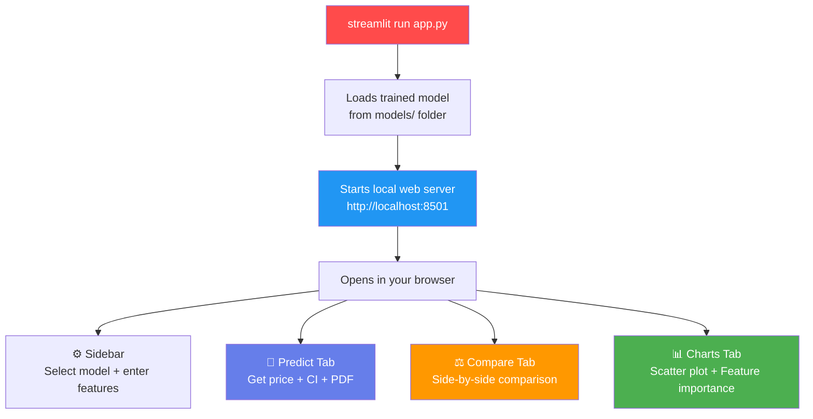

Your browser will open to `http://localhost:8501` automatically. To stop the server, press `Ctrl+C` in the terminal.

---

## 🧠 How Model Training Actually Works

### The Two Models Explained

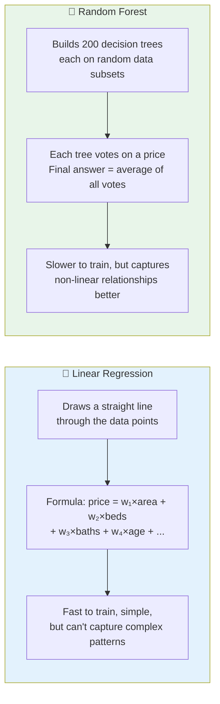

### How the Code Maps to ML Concepts

| ML Concept | What it means | Where in code | What it does |
|------------|---------------|---------------|--------------|
| **Load data** | Read CSV into memory | `HouseData.load()` in `preprocess.py` | `pd.read_csv("data/house_data.csv")` |
| **Clean data** | Fix missing values | `Preprocessor.clean()` | Fills NaN with median (numbers) or mode (text) |
| **Feature engineering** | Create new useful columns | `Preprocessor.engineer_features()` | Adds Price_Per_SqFt, Age_Bucket, BedBath_Ratio |
| **Train/test split** | Keep 20% data unseen for evaluation | `Preprocessor.split()` | `train_test_split(X, y, test_size=0.2)` |
| **Scaling** | Make all numbers same scale | `StandardScaler` in `Preprocessor` | Transforms to mean=0, std=1 |
| **Encoding** | Convert text → numbers | `OneHotEncoder` | Location → 4 binary columns |
| **Training** | Model learns patterns | `trainer.model.fit(X, y)` in `train.py` | The core ML step |
| **Cross-validation** | Check if model generalizes | `cross_val_score()` | Tests on 5 different data splits |
| **Evaluation** | Measure accuracy | `Evaluator.report()` | Calculates MAE, RMSE, R² |
| **Persistence** | Save model to disk | `ArtifactStore.save()` | `joblib.dump()` to `.joblib` file |
| **Inference** | Predict on new data | `Predictor.predict()` in `model.py` | `model.predict(X_encoded)` |

### What Each Metric Means

| Metric | Full Name | What it tells you | Good value |
|--------|-----------|-------------------|:----------:|
| **R²** | R-squared | "How much of the price variation can the model explain?" | > 0.90 |
| **MAE** | Mean Absolute Error | "On average, how many Lakhs off is the prediction?" | Lower = better |
| **RMSE** | Root Mean Squared Error | "Like MAE but punishes big errors more" | Lower = better |
| **CV R²** | Cross-validation R² | "Does the model work on different data splits?" | > 0.85 |
| **Residual Std** | Std Dev of errors | "Used to build the 95% confidence interval" | Lower = tighter CI |

### Our Model Results

| Metric | Linear Regression | Random Forest | What this tells us |
|--------|:-----------------:|:-------------:|-------------------|
| R² | 0.9018 | **0.9313** | RF explains 93% of price variation |
| MAE | 19.38 L | **15.11 L** | RF predictions are off by ~15L on average |
| RMSE | 24.82 L | **20.77 L** | RF has smaller big errors |
| CV R² | 0.8782 | **0.8816** | Both generalize well (no overfitting) |

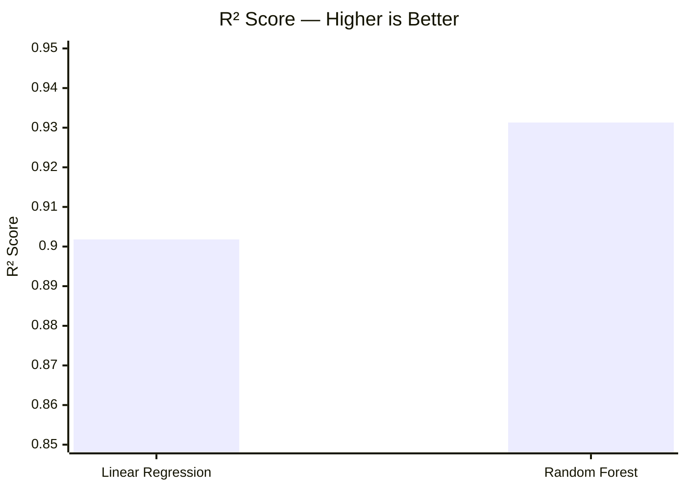

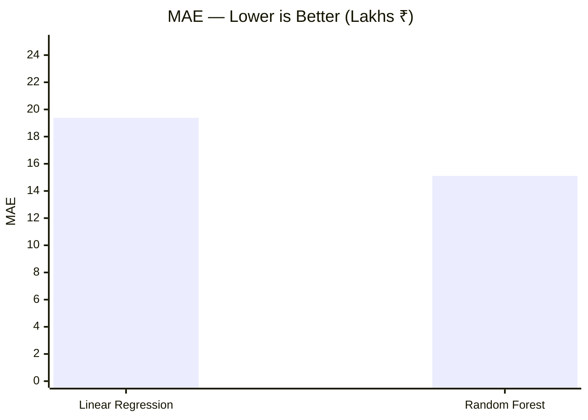

---

## 🔬 Key ML Concepts You Should Know

### 1. Why Split into Train & Test?

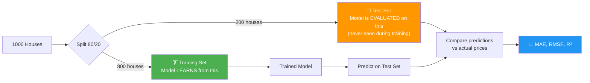

> If you test on the same data you trained on, the model will seem amazing but fail on new data. That's called **overfitting**.

### 2. Why Scale Numbers?

| Feature | Raw Range | After Scaling |
|---------|-----------|:------------:|
| Area | 500 – 5,000 | -1.7 to +1.7 |
| Bedrooms | 1 – 6 | -1.5 to +1.5 |
| Age | 0 – 50 | -1.7 to +1.7 |

Without scaling, Area (which has big numbers) would dominate the model. Scaling puts everything on the same playing field.

### 3. Why One-Hot Encode Location?

ML models work with **numbers only**. So:

| Location | Downtown | Urban | Suburban | Rural |
|----------|:--------:|:-----:|:--------:|:-----:|
| Downtown | 1 | 0 | 0 | 0 |
| Urban | 0 | 1 | 0 | 0 |
| Suburban | 0 | 0 | 1 | 0 |
| Rural | 0 | 0 | 0 | 1 |

This turns 1 text column into 4 binary columns the model can understand.

### 4. What is Cross-Validation?

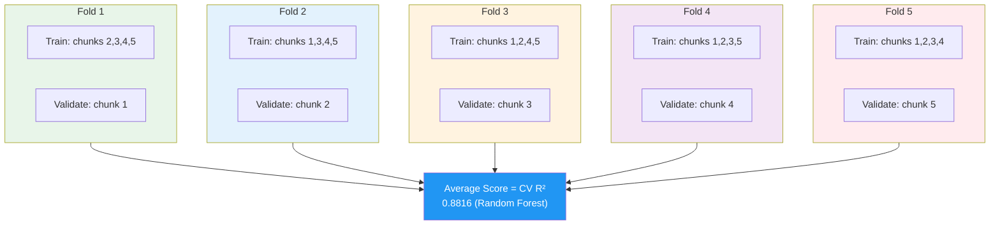

The training data is split 5 ways. Each time, 4 chunks train and 1 chunk validates. The average score tells you if the model truly generalizes.

---

## 🧪 Experiment: Modify & Re-Train

Once you understand the flow, try these experiments:

### Experiment 1: Change Random Forest Parameters

Open `train.py`, find line 68-71, and try:

```python
# Original
RandomForestRegressor(n_estimators=200, max_depth=20, random_state=42)

# Try more trees
RandomForestRegressor(n_estimators=500, max_depth=25, random_state=42)
```

Then re-train: `python train.py --model random_forest`

### Experiment 2: Generate More Data

Open `generate_data.py`, change line 19:

```python
# Original
N_SAMPLES = 1000

# Try more
N_SAMPLES = 5000
```

Then: `python generate_data.py` → `python train.py`

### Experiment 3: Change Train/Test Split

Open `preprocess.py`, find line 132-133:

```python
# Original: 80/20 split
test_size: float = 0.2

# Try 70/30 split
test_size: float = 0.3
```

Then: `python train.py`

> **Tip:** Compare your new R² and MAE against the original values to see what improved!

---

## 📋 Quick Reference Card

| What do you want to do? | Command |
|--------------------------|---------|
| **Activate venv** | `venv\Scripts\activate` (CMD) or `.\venv\Scripts\Activate.ps1` (PS) |
| **Install packages** | `pip install -r requirements.txt` |
| **Generate dataset** | `python generate_data.py` |
| **Train all models** | `python train.py` |
| **Train one model** | `python train.py --model random_forest` |
| **Run the web app** | `streamlit run app.py` |
| **Stop the app** | Press `Ctrl+C` in terminal |
| **Deactivate venv** | `deactivate` |
| **Check installed packages** | `pip list` |
| **See training help** | `python train.py --help` |

---

<div align="center">

### 🎓 You now understand the full project!

_This summary is gitignored — it's your private learning reference._

</div>
]]>
